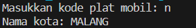

# Laporan Praktikum Pertemuan 1

## Praktikum Pemilihan

Output dari kode program 

hasil run diatas adalah hasil kode program untuk menghitung nilai akhir dari mahasiswa dengan ketentuan 20% nilai
tugas, 20% dari nilai kuis, 30% nilai UTS, dan 40% nilai UAS. Setiap nilai yang dimasukkan
mempunyai batas nilai 0 ‐ 100. Ketika pengguna memasukkan diluar rentang tersebut maka
akan keluar output “nilai tidak valid”. Ketika nilai akhir sudah didapatkan selanjutnya
lakukan konversi nilai dengan ketentuan-kentetuannya.

## Praktikum Perulangan
Output dari kode program

Hasil run diatas adalah hasil dari kode program yang dapat menampilkan deretan bilangan dari angka 1 sampai n kecuali
angka 6 dan 10, angka ganjil dicetak dengan asterik “*”, angka genap dicetak sesuai bilangan
aslinya, dengan n = 2 digit terakhir NIM.

## Praktikum Array
Output dari kode program

hasil run diatas adalah hasil kode program menghitung IP Semester dari matakuliah yang ditempuh.
program meminta user memasukkan nama matkul dan bobot sks masing-masing matkul. Setelah itu program juga meminta user memasukkan nilai angka tiap matkul yang kemudian dikonversi menjadi nilai huruf dan nilai.
Kemudian program menampilkan hasil konversi nilai tersebut. Lalu menghitung total nilai dan IPK dengan rumus totalNilai = jumlah perkalian antara nilai setara dan sks matkul, dibagi total sks. Hasil perhitungan IPK ditampilkan.

## Praktikum Fungsi
Output dari kode program

hasil run diatas adalah hasil kode program yang digunakan untuk menghitung pendapatan tiap Royal Garden berdasarkan stok dan harga bunga, serta mengadjust stok bunga di Royal Garden 4 dengan memperhitungkan bunga mati.

## Tugas 1
Output dari kode program

hasil run diatas adalah hasil dari kode program Array.
Pertama adalah array satu dimensi char KODE[10], berisi kode plat mobil. Array kedua, array
dua dimensi char KOTA[10][12] berisi nama kota yang berpasangan dengan kode plat mobil. Ketika pengguna memberikan input kode plat nomor maka program akan mengeluarkan
nama kota dari kode plat nomor tersebut.

## Tugas 2
Output dari kode program

hasil run diatas adalah hasil dari kode program untuk menghitung rumus kecepatan, jarak, dan waktu dengan menerima input dari pengguna dan menampilkan hasil perhitungannya.