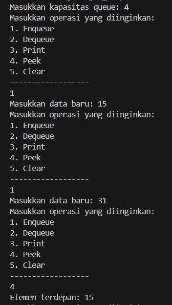
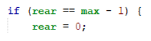
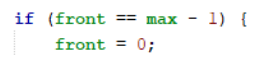
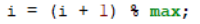
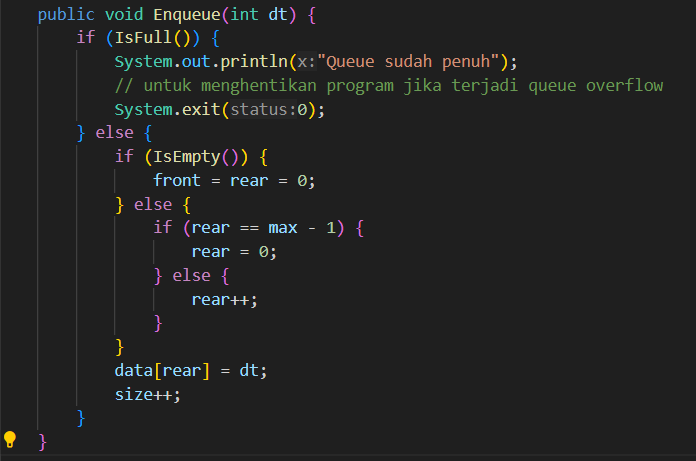
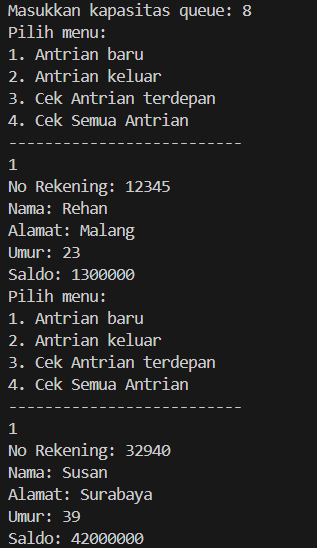
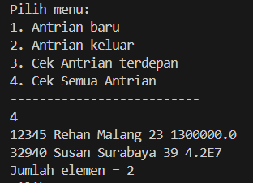
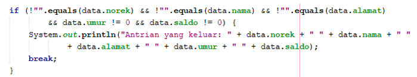

# Lapooran Praktikum 10
## Praktikum 1
#### Kode Program
Queue
```java
/**
 * Queue
 */
public class Queue {

    int[] data;
    int front;
    int rear;
    int size;
    int max;

    public Queue(int n) {
        max = n;
        data = new int[max];
        size = 0;
        front = rear = -1;
    }

    public boolean IsEmpty() {
        if (size == 0) {
            return true;
        } else {
            return false;
        }
    }

    public boolean IsFull() {
        if (size == max) {
            return true;
        } else {
            return false;
        }
    }

    public void peek() {
        if (!IsEmpty()) {
            System.out.println("Elemen terdepan: " + data[front]);
        } else {
            System.out.println("Queue masih kosong");
        }
    }

    public void print() {
        if (IsEmpty()) {
            System.out.println("Queue masih kosong");
        } else {
            int i = front;
            while (i !=rear) {
                System.out.print(data[i] + " ");
                i = (i + 1) % max;
            }
            System.out.println(data[i] + " ");
            System.out.println("Jumlah elemen = " + size);
        }
    }

    public void clear() {
        if (!IsEmpty()) {
            front = rear = -1;
            size = 0;
            System.out.println("Queue berhasil dikosongkan");
        } else {
            System.out.println("Queue masih kosong");
        }
    }

    public void Enqueue(int dt) {
        if (IsFull()) {
            System.out.println("Queue sudah penuh");
        } else {
            if (IsEmpty()) {
                front = rear = 0;
            } else {
                if (rear == max - 1) {
                    rear = 0;
                } else {
                    rear++;
                }
            }
            data[rear] = dt;
            size++;
        }
    }

    public int Dequeue() {
        int dt = 0;
        if (IsEmpty()) {
            System.out.println("Queue masih kosong");
        } else {
            dt = data[front];
            size--;
            if (IsEmpty()) {
                front = rear = -1;
            } else {
                if (front == max - 1) {
                    front = 0;
                } else {
                    front++;
                }
            }
        }
        return dt;
    }

    
}
```
QueueMain
```java
import java.util.Scanner;
public class QueueMain {
    public static void menu() {
        System.out.println("Masukkan operasi yang diinginkan:");
        System.out.println("1. Enqueue");
        System.out.println("2. Dequeue");
        System.out.println("3. Print");
        System.out.println("4. Peek");
        System.out.println("5. Clear");
        System.out.println("------------------");
    }

    public static void main(String[] args) {
        Scanner sc = new Scanner(System.in);

        System.out.print("Masukkan kapasitas queue: ");
        int n = sc.nextInt();

        Queue Q = new Queue(n);

        int pilih;
        do {
            menu();
            pilih = sc.nextInt();
            switch (pilih) {
                case 1:
                    System.out.print("Masukkan data baru: ");
                    int dataMasuk = sc.nextInt();
                    Q.Enqueue(dataMasuk);
                    break;
            
                case 2:
                    int dataKeluar = Q.Dequeue();
                    if (dataKeluar != 0) {
                        System.out.println("Data yang dikeluarkan: " + dataKeluar);
                        break;
                    }
                case 3:
                    Q.print();
                    break;
                case 4:
                    Q.peek();
                    break;
                case 5:
                    Q.clear();
                    break;
            }
        } while (pilih == 1 || pilih == 2 || pilih == 4 || pilih ==5);
    }
}
```
#### Hasil run


#### Pertanyaan
1. Pada konstruktor, mengapa nilai awal atribut front dan rear bernilai -1, sementara atribut size 
bernilai 0?

2. Pada method Enqueue, jelaskan maksud dan kegunaan dari potongan kode berikut! 


3. Pada method Dequeue, jelaskan maksud dan kegunaan dari potongan kode berikut! 


4. Pada method print, mengapa pada proses perulangan variabel i tidak dimulai dari 0 (int i=0), 
melainkan int i=front?
5. Perhatikan kembali method print, jelaskan maksud dari potongan kode berikut! 


6. Tunjukkan potongan kode program yang merupakan queue overflow!
7. Pada saat terjadi queue overflow dan queue underflow, program tersebut tetap dapat berjalan 
dan hanya menampilkan teks informasi. Lakukan modifikasi program sehingga pada saat terjadi 
queue overflow dan queue underflow, program dihentikan!

#### Jawaban
1.  -1 untuk menandakan bahwa queue masih kosong. Sementara itu, atribut size diinisialisasi dengan 0 karena memang tidak ada elemen yang tersimpan dalam queue.
2. kode tersebut digunakan untuk menangani kondisi khusus pada operasi enqueue ketika posisi rear sudah mencapai ujung array. Dalam implementasi queue menggunakan array, ketika kita memasukkan elemen baru ke dalam queue (enqueue), posisi rear akan bergerak maju. Namun, ketika rear mencapai ujung array (index max - 1), kita tidak dapat lagi menambahkan elemen baru karena array telah mencapai batasnya.
3. kode tersebut digunakan untuk menangani kondisi khusus pada operasi dequeue ketika posisi front sudah mencapai ujung array. Ketika kita mengeluarkan elemen dari depan queue (dequeue), posisi front akan bergerak maju. Namun, ketika front mencapai ujung array (index max - 1), kita tidak dapat lagi mengeluarkan elemen karena front sudah berada di ujung array.
4. Pada method print(), variabel i diinisialisasi dengan front (int i = front;) bukan dengan 0 karena dalam implementasi queue ini, elemen terdepan (front) tidak selalu berada di indeks 0 dari array data. Posisi front dapat berubah-ubah sesuai dengan operasi enqueue dan dequeue yang dilakukan.
5. Potongan kode i = (i + 1) % max; digunakan dalam method print() untuk mengimplementasikan konsep circular buffer dalam pencetakan elemen-elemen queue.ketika kita mencapai ujung array (indeks maksimum max - 1), kita akan kembali ke awal array (indeks 0) dan melanjutkan operasi dari sana.
6. Berikut adalah program yang merupakan overflow 
```java
public void Enqueue(int dt) {
        if (IsFull()) {
            System.out.println("Queue sudah penuh");
        } else {
            if (IsEmpty()) {
                front = rear = 0;
            } else {
                if (rear == max - 1) {
                    rear = 0;
                } else {
                    rear++;
                }
            }
            data[rear] = dt;
            size++;
        }
    }
```
7. 

## Praktikum 2
#### Kode Program
Nasabah
```java
public class Nasabah {
   String norek;
   String nama;
   String alamat;
   int umur;
   double saldo; 
   
    Nasabah (String norek, String nama, String alamat, int umur, double saldo) {
        this.norek = norek;
        this.nama = nama;
        this.alamat = alamat;
        this.umur = umur;
        this.saldo = saldo;

    }
}
```

Queue2
```java
/**
 * Queue2
 */
public class Queue2 {

    Nasabah[] data;
    int front;
    int rear;
    int size;
    int max;

    public Queue2(int n) {
        max = n;
        data = new Nasabah[max];
        size = 0;
        front = rear = -1;
    }

    public boolean IsEmpty() {
        if (size == 0) {
            return true;
        } else {
            return false;
        }
    }

    public boolean IsFull() {
        if (size == max) {
            return true;
        } else {
            return false;
        }
    }

    void peek() {
        if (!IsEmpty()) {
            System.out.println("Elemen terdepan : " + data[front].norek + " " + data[front].nama + " "
                    + data[front].alamat + " " + data[front].umur + " " + data[front].saldo);
        } else {
            System.out.println("Queue masih kosong");
        }
    }

    void print() {
        if (IsEmpty()) {
            System.out.println("Queue masih kosong");
        } else {
            int i = front;
            while (i != rear) {
                System.out.println(data[i].norek + " " + data[i].nama + " "
                        + data[i].alamat + " " + data[i].umur + " " + data[i].saldo);
                i = (i + 1) % max;
            }
            System.out.println(data[i].norek + " " + data[i].nama + " "
                    + data[i].alamat + " " + data[i].umur + " " + data[i].saldo);
            System.out.println("Jumlah elemen = " + size);
        }
    }

    public void Enqueue(Nasabah dt) {
        if (IsFull()) {
            System.out.println("Queue sudah penuh");
        } else {
            if (IsEmpty()) {
                front = rear = 0;
            } else {
                if (rear == max - 1) {
                    rear = 0;
                } else {
                    rear++;
                }
            }
            data[rear] = dt;
            size++;
        }
    }

    public Nasabah Dequeue() {
        Nasabah dt = new Nasabah(null, null, null, max, front);
        if (IsEmpty()) {
            System.out.println("Queue masih kosong");
        } else {
            dt = data[front];
            size--;
            if (IsEmpty()) {
                front = rear = -1;
            } else {
                if (front == max - 1) {
                    front = 0;
                } else {
                    front++;
                }
            }
        }
        return dt;
    }   

    public static void menu() {
        System.out.println("Pilih menu: ");
        System.out.println("1. Antrian baru");
        System.out.println("2. Antrian keluar");
        System.out.println("3. Cek Antrian terdepan");
        System.out.println("4. Cek Semua Antrian");
        System.out.println("--------------------------");
    }

}
```
Queue2Main
```java
import java.util.Scanner;

/**
 * Queue2Main
 */
public class Queue2Main {

    public static void menu() {
        System.out.println("Pilih menu: ");
        System.out.println("1. Antrian baru");
        System.out.println("2. Antrian keluar");
        System.out.println("3. Cek Antrian terdepan");
        System.out.println("4. Cek Semua Antrian");
        System.out.println("--------------------------");
    }
    public static void main(String[] args) {
        Scanner sc = new Scanner(System.in);

        System.out.print("Masukkan kapasitas queue: ");
        int jumlah = sc.nextInt();
        Queue2 antri = new Queue2(jumlah);
        int pilih = 0;
        
        do {
            menu();
            pilih = sc.nextInt();
            sc.nextLine();
            
            switch (pilih) {
                case 1:
                    System.out.print("No Rekening: ");
                    String norek = sc.nextLine();
                    System.out.print("Nama: ");
                    String nama = sc.nextLine();
                    System.out.print("Alamat: ");
                    String alamat = sc.nextLine();
                    System.out.print("Umur: ");
                    int umur = sc.nextInt();
                    System.out.print("Saldo: ");
                    double saldo = sc.nextDouble();   
                    Nasabah nb = new Nasabah(norek, nama, alamat, umur, saldo);
                    sc.nextLine();
                    antri.Enqueue(nb);            
                    break;
            
                case 2:
                    Nasabah data = antri.Dequeue();
                    if (!"".equals(data.norek) && !"".equals(data.nama) && !"".equals(data.alamat)
                        && data.umur !=0 && data.saldo != 0) {
                        System.out.println("Antrian yang keluar: " + data.norek + " " + data.nama + " "
                            + data.alamat + " " + data.umur + " " + data.saldo);
                    break;
                    }
                
                case 3:
                    antri.peek();
                    break;
                case 4:
                    antri.print();
                    break;
            }
        } while (pilih == 1 || pilih == 2 || pilih == 3 || pilih == 4);

    }
}
```

#### Hasil run



#### Pertanyaan
1. Pada class QueueMain, jelaskan fungsi IF pada potongan kode program berikut! 


2. Lakukan modifikasi program dengan menambahkan method baru bernama peekRear pada class Queue yang digunakan untuk mengecek antrian yang berada di posisi belakang! Tambahkan pula daftar menu 5. Cek Antrian paling belakang pada class QueueMain sehingga method peekRear dapat dipanggil! 

#### Jawaban
1.  if digunakan untuk memastikan bahwa objek Nasabah yang diambil dari antrian memiliki nilai yang valid sebelum menampilkan data tersebut. Kondisi if terdiri dari beberapa pernyataan boolean yang dihubungkan dengan operator logika &&.
2. 