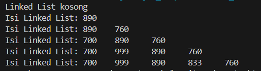
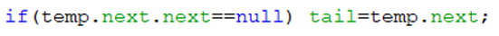
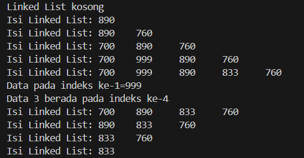
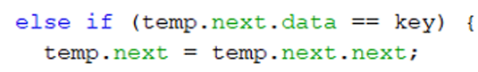

# Laporan Praktikium 11
## Praktikum 1 : Pembuatan Single Linked List 
#### Kode Program
Class Node
```java
public class Node {
    int data;
    Node next;

    public Node(int nilai, Node berikutnya) {
        this.data=nilai;    
        this.next=berikutnya;
    }

}
```
Class SingleLinkedList
```java
public class SingleLinkedList {
    
    Node head, tail;


    public boolean isEmpty() {
    return head == null;
    }

    public void print() {
        if (!isEmpty()) {
            Node tmp = head;
            System.out.print("Isi Linked List: ");
        while (tmp !=null) {
            System.out.print(tmp.data + "\t");
            tmp = tmp.next;
        }
        System.out.println(" ");
        } else {
        System.out.println("Linked List kosong");
        }
    }

    public void addFirst(int input) {
        Node ndInput = new Node(input, head);
        if (isEmpty()) {
            head = ndInput;
            tail = ndInput;
        } else {
            head = ndInput;
        }
    }

    public void addLast(int input) {
        Node ndInput = new Node(input, null);
        if (isEmpty()) {
            head = ndInput;
        } else {
            tail.next = ndInput;
        }
        tail = ndInput;
    }

    public void insertAfter(int key, int input) {
        Node ndInput = new Node(input, head);
        Node temp = head;
        while (temp != null) {
            if (temp.data == key) {
                ndInput.next = temp.next;
                temp.next = ndInput;
                if(ndInput.next==null){
                    tail = ndInput;
                } 
                break;
            }
            temp = temp.next;
        }
    }

    public void insertAt(int index, int input) {
        if (index < 0) {
            System.out.println("indeks harus >= 0");
            return;
        } 
        if (index == 0) {
            addFirst(input);
            return;
        } 
        Node temp = head;
        for (int i = 1; i < index && temp.next != null; i++) {
                temp = temp.next;
        }
        Node ndInput = new Node(input, temp.next);
        temp.next = ndInput;
            if (temp.next.next==null) {
                tail = temp.next;
            }
        }
    }  
```
Class SLLMain
```java
public class SLLMain {
    public static void main(String[] args) {
        SingleLinkedList singLL = new SingleLinkedList();

        singLL.print();
        singLL.addFirst(890);
        singLL.print();
        singLL.addLast(760);
        singLL.print();
        singLL.addFirst(700);
        singLL.print();
        singLL.insertAfter(700, 999);
        singLL.print();
        singLL.insertAt(3, 833);
        singLL.print();
    }
}
```
#### Hasil run


#### Pertanyaan 
1. Mengapa hasil compile kode program di baris pertama menghasilkan “Linked List Kosong”? 
2. Jelaskan kegunaan variable temp secara umum pada setiap method! 
3. Perhatikan class SingleLinkedList, pada method insertAt Jelaskan kegunaan kode berikut 


#### Jawaban
1. Karena pada saat program dijalankan, linked list masih dalam keadaan kosong atau belum ada node yang ditambahkan.
2. Dalam method print(): Variabel tmp digunakan untuk menyimpan referensi ke node pertama (head) agar dapat melakukan iterasi melalui setiap node dalam linked list. 

    Dalam method insertAfter(int key, int input):
    Variabel temp digunakan untuk mencari node dengan data yang sama dengan key.

    Dalam method insertAt(int index, int input):
    Variabel temp digunakan untuk mencari node sebelum indeks index yang ditentukan.
3. Kode tersebut digunakan untuk memperbarui posisi tail (node terakhir) dalam linked list setelah melakukan penyisipan node baru.

## Percobaan 2 : Modifikasi Elemen pada Single Linked List 
#### Kode Program
Class singleLinkedList
```java
public class SingleLinkedList {
    
    Node head, tail;


    public boolean isEmpty() {
    return head == null;
    }

    public void print() {
        if (!isEmpty()) {
            Node tmp = head;
            System.out.print("Isi Linked List: ");
        while (tmp !=null) {
            System.out.print(tmp.data + "\t");
            tmp = tmp.next;
        }
        System.out.println(" ");
        } else {
        System.out.println("Linked List kosong");
        }
    }

    public void addFirst(int input) {
        Node ndInput = new Node(input, head);
        if (isEmpty()) {
            head = ndInput;
            tail = ndInput;
        } else {
            head = ndInput;
        }
    }

    public void addLast(int input) {
        Node ndInput = new Node(input, null);
        if (isEmpty()) {
            head = ndInput;
        } else {
            tail.next = ndInput;
        }
        tail = ndInput;
    }

    public void insertAfter(int key, int input) {
        Node ndInput = new Node(input, head);
        Node temp = head;
        while (temp != null) {
            if (temp.data == key) {
                ndInput.next = temp.next;
                temp.next = ndInput;
                if(ndInput.next==null){
                    tail = ndInput;
                } 
                break;
            }
            temp = temp.next;
        }
    }

    public void insertAt(int index, int input) {
        if (index < 0) {
            System.out.println("indeks harus >= 0");
            return;
        } 
        if (index == 0) {
            addFirst(input);
            return;
        } 
        Node temp = head;
        for (int i = 1; i < index && temp.next != null; i++) {
                temp = temp.next;
        }
        Node ndInput = new Node(input, temp.next);
        temp.next = ndInput;
            if (temp.next.next==null) {
                tail = temp.next;
            }
    }

    public int getData(int index) {
        Node tmp = head;
        for (int i = 0; i < index; i++) {
            tmp = tmp.next;
        }
        return tmp.data;
    }

    public int indexOf(int key) {
        Node tmp = head;
        int index = 0;
        while (tmp !=null && tmp.data != key) {
            tmp = tmp.next;
            index++;
        }
        if (tmp == null) {
            return -1;
        } else {
            return index;
        }
    }

    public void removefirst() {
        if (isEmpty()) {
            System.out.println("Linked list masih kosong," + "tidak dapat dihapus");
        } else if (head == tail) {
            head = tail = null;
        } else {
            head = head.next;
        }
    }

    public void removeLast() {
        if (isEmpty()) {
            System.out.println("Linked list masih kosong," + "tidak dapat dihapus");
        } else if (head == tail) {
            head = tail = null;
        } else {
            Node temp = head;
            while (temp.next != tail) {
                temp = temp.next;
            }
            temp.next = null;
            tail = temp;
        }
    }

    public void remove(int key) {
        if (isEmpty()) {
            System.out.println("Linked list masih kosong," + "tidak dapat dihapus");
        } else {
            Node temp = head;
            while (temp != null) {
                if ((temp.data == key) && (temp == head)) {
                    this.removefirst();
                    break;
                } else if (temp.next.data == key) {
                    temp.next = temp.next.next;
                    if (temp.next == null) {
                        tail = temp;
                    }
                    break;
                }
                temp = temp.next;
            }
        }
    }

    public void removeAt(int index) {
        if (index == 0) {
            removefirst();
        } else {
            Node temp = head;
            for (int i = 0; i < index - 1; i++) {
                temp = temp.next;
            }
            temp.next = temp.next.next;
            if (temp.next == null) {
                tail = temp;
            }
        }
    }
}  
```
Class SLLMain
```java
public class SLLMain {
    public static void main(String[] args) {
        SingleLinkedList singLL = new SingleLinkedList();

        singLL.print();
        singLL.addFirst(890);
        singLL.print();
        singLL.addLast(760);
        singLL.print();
        singLL.addFirst(700);
        singLL.print();
        singLL.insertAfter(700, 999);
        singLL.print();
        singLL.insertAt(3, 833);
        singLL.print();

        System.out.println("Data pada indeks ke-1=" + singLL.getData(1));
        System.out.println("Data 3 berada pada indeks ke-" + singLL.indexOf(760));

        singLL.remove(999);
        singLL.print();
        singLL.removeAt(0);
        singLL.print();
        singLL.removefirst();
        singLL.print();
        singLL.removeLast();
        singLL.print();
    }
}
```
#### Hasil run


#### Pertanyaan
1. Mengapa digunakan keyword break pada fungsi remove? Jelaskan! 
2. Jelaskan kegunaan kode dibawah pada method remove 

#### Jawaban
1.  keyword break digunakan untuk keluar dari loop while setelah node dengan data yang sesuai dengan key ditemukan dan dihapus.
2. Kode tersebut pada kondisi else if dalam method remove digunakan untuk menghapus node yang datanya sama dengan key dari linked list, kecuali jika node tersebut adalah node pertama (head).

## Tugas Praktikum
