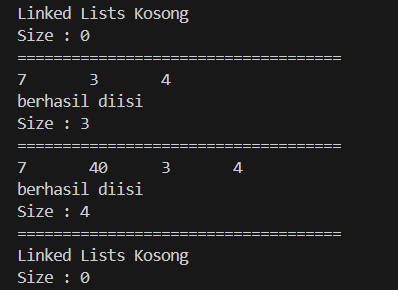
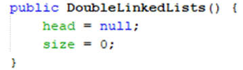
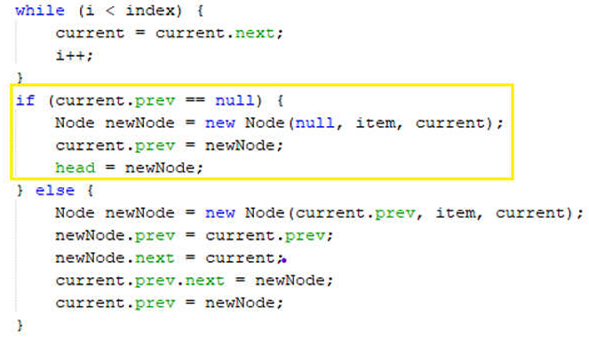
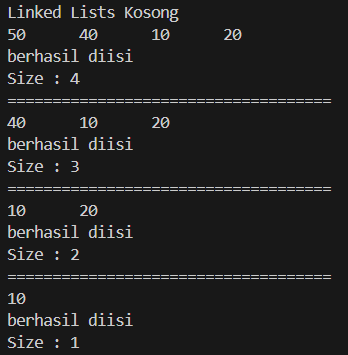
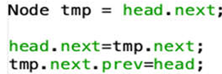
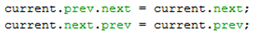
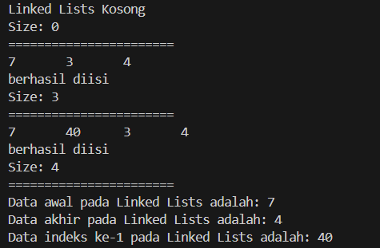
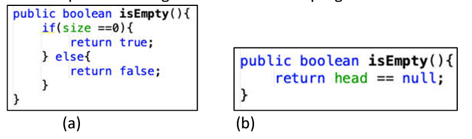

# Laporan Praktikum 12
## Praktikum 1
#### Kode Program
class Node
```java
/**
 * Node
 */
public class Node {
    int data;
    Node prev, next;
    
    Node (Node prev, int data, Node next) {
        this.prev = prev;
        this.data = data;
        this.next = next;
    }
}
```

class DoubleLinkedLists
```java
public class DoubleLinkedLists {
    
    Node head;
    int size;

    public DoubleLinkedLists() {
        head = null;
        size = 0;
    }

    public boolean isEmpty() {
        return head == null;
    }

    public void addFirst (int item) {
        if (isEmpty()) {
            head = new Node (null, item, null);
        } else {
            Node newNode = new Node(null, item, head);
            head.prev = newNode;
            head = newNode;
        }
        size++;
    }

    public void addLast (int item) {
        if (isEmpty()) {
            addFirst(item);
        } else {
            Node current = head;
            while (current.next != null) {
                current = current.next;
            }
            Node newnNode = new Node(current, item, null);
            current.next = newnNode;
            size++;
        }
    }

    public void add (int item, int index) throws Exception {
        if (isEmpty()) {
            addFirst(item);
        } else if (index < 0 || index > size) {
            throw new Exception("Nilai indeks di luar batas");
        } else {
            Node current = head;
            int i = 0;
            while (i < index) {
                current = current.next;
                i++;
            }
            if (current.prev == null) {
                Node newNode = new Node(null, item, current);
                current.prev = newNode;
                head = newNode;
            } else {
                Node newNode = new Node(current.prev, item, current);
                newNode.prev = current.prev;
                newNode.next = current;
                current.prev.next = newNode;
                current.prev = newNode;
            }
        }
        size++;
    }

    public int size() {
        return size;
    }

    public void clear() {
        head = null;
        size = 0;
    }

    public void print() {
        if (!isEmpty()) {
            Node tmp = head;
            while (tmp != null) {
                System.out.print(tmp.data + "\t");
                tmp = tmp.next;
            }
            System.out.println("\nberhasil diisi");
        } else {
            System.out.println("Linked List Kosong");
        }
    }
}
```

class DoubleLinkedListsMain
```java
public class DoubleLinkedListsMain {
    public static void main(String[] args) throws Exception {
        DoubleLinkedLists dll = new DoubleLinkedLists();
        dll.print();
        System.out.println("Size : " + dll.size());
        System.out.println("====================================");
        dll.addFirst(3);
        dll.addLast(4);
        dll.addFirst(7);
        dll.print();
        System.out.println("Size : " + dll.size());
        System.out.println("====================================");
        dll.add(40, 1);
        dll.print();
        System.out.println("Size : " + dll.size());
        System.out.println("====================================");
        dll.clear();
        dll.print();
        System.out.println("Size : " + dll.size());
    }
}
```

#### Output


#### Pertanyaan
1. Jelaskan perbedaan antara single linked list dengan double linked lists! 
2. Perhatikan class Node, di dalamnya terdapat atribut next dan prev. Untuk apakah atribut tersebut? 
3. Perhatikan konstruktor pada class DoubleLinkedLists. Apa kegunaan inisialisasi atribut head dan size seperti pada gambar berikut ini? 

4. Pada method addFirst(), kenapa dalam pembuatan object dari konstruktor class Node prev dianggap sama dengan null? Node newNode = new Node(null, item, head); 
5. Perhatikan pada method addFirst().  Apakah arti statement head.prev = newNode ? 
6. Perhatikan isi method addLast(), apa arti dari pembuatan object Node dengan mengisikan parameter prev dengan current, dan next dengan null? Node newNode = new Node(current, item, null);  
7. Pada method add(), terdapat potongan kode program sebagai berikut: 
 jelaskan maksud dari bagian yang ditandai dengan kotak kuning.

#### Jawaban
1. Setiap node dalam single linked list hanya memiliki satu pointer yang menunjuk ke node berikutnya dalam daftar. Tetapi  double linked list memiliki dua pointer: satu menunjuk ke node berikutnya dan satu lagi menunjuk ke node sebelumnya.
2. next adalah sebuah referensi (pointer) yang menunjuk ke node berikutnya. Dan prev adalah sebuah referensi (pointer) yang menunjuk ke node sebelumnya.
3. Atribut head merupakan referensi yang menunjuk ke node pertama (kepala) dalam Double Linked List. Dan Atribut size digunakan untuk menyimpan jumlah node yang ada dalam Double Linked List.
4. Alasan prev diinisialisasi dengan null adalah karena node yang baru ditambahkan akan menjadi node pertama (head) dalam Double Linked List.
5. Statement tersebut digunakan untuk mengatur pointer prev dari node lama (yang sebelumnya menjadi head) agar menunjuk ke node baru (newNode) yang ditambahkan di awal Double Linked List.
6. currentParameter current dalam konstruktor Node digunakan untuk menginisialisasi atribut prev dari newNode.
Parameter item digunakan untuk menyimpan data yang akan ditambahkan ke Double Linked List sebagai node baru.
Parameter null dalam konstruktor Node digunakan untuk menginisialisasi atribut next dari newNode. next diinisialisasi dengan null karena newNode akan menjadi node terakhir dalam Double Linked List, sehingga tidak ada node berikutnya setelah newNode.
7. Kode tersebut merupakan bagian dari method add() yang digunakan untuk menambahkan node baru pada indeks tertentu dalam Double Linked List. Kode tersebut berfungsi untuk menangani kasus khusus ketika node baru akan ditambahkan di posisi pertama (indeks 0) dalam Double Linked List.

## Praktikum 2
#### Kode Program
class DoubleLinkedLists
```java
public class DoubleLinkedLists {
    
    Node head;
    int size;

    public DoubleLinkedLists() {
        head = null;
        size = 0;
    }

    public boolean isEmpty() {
        return head == null;
    }

    public void addFirst (int item) {
        if (isEmpty()) {
            head = new Node (null, item, null);
        } else {
            Node newNode = new Node(null, item, head);
            head.prev = newNode;
            head = newNode;
        }
        size++;
    }

    public void addLast (int item) {
        if (isEmpty()) {
            addFirst(item);
        } else {
            Node current = head;
            while (current.next != null) {
                current = current.next;
            }
            Node newnNode = new Node(current, item, null);
            current.next = newnNode;
            size++;
        }
    }

    public void add (int item, int index) throws Exception {
        if (isEmpty()) {
            addFirst(item);
        } else if (index < 0 || index > size) {
            throw new Exception("Nilai indeks di luar batas");
        } else {
            Node current = head;
            int i = 0;
            while (i < index) {
                current = current.next;
                i++;
            }
            if (current.prev == null) {
                Node newNode = new Node(null, item, current);
                current.prev = newNode;
                head = newNode;
            } else {
                Node newNode = new Node(current.prev, item, current);
                newNode.prev = current.prev;
                newNode.next = current;
                current.prev.next = newNode;
                current.prev = newNode;
            }
        }
        size++;
    }

    public int size() {
        return size;
    }

    public void clear() {
        head = null;
        size = 0;
    }

    public void print() {
        if (!isEmpty()) {
            Node tmp = head;
            while (tmp != null) {
                System.out.print(tmp.data + "\t");
                tmp = tmp.next;
            }
            System.out.println("\nberhasil diisi");
        } else {
            System.out.println("Linked Lists Kosong");
        }
    }

    public void removeFirst() throws Exception {
        if (isEmpty()) {
            throw new Exception("Linked List masih kosong, tidak dapat dihapus!");
        } else if (size == 1) {
            removeLast();
        } else {
            head = head.next;
            head.prev = null;
            size--;
        }
    }

    public void removeLast() throws Exception {
        if (isEmpty()) {
            throw new Exception("Linked list masih kosong, tidak dapat dihapus!");
        } else if (head.next == null) {
            head = null;
            size--;
            return;
        }
        Node current = head;
        while (current.next.next != null) {
            current = current.next;
        }
        current.next = null;
        size--;
    }

    public void remove (int index) throws Exception {
        if (isEmpty() || index >= size) {
            throw new Exception("Nilai indeks di luar batas");
        } else if (index == 0) {
            removeFirst();
        } else {
            Node current = head;
            int i = 0;
            while (i < index) {
                current = current.next;
                i++;
            }
            if (current.next == null) {
                current.prev.next = null;
            } else if (current.prev == null) {
                current = current.next;
                current.prev = null;
                head = current;
            } else {
                current.prev.next = current.next;
                current.next.prev = current.prev;
            }
            size--;
        }
    }

}
```
class DoubleLinkedListsMain
```java
public class DoubleLinkedListsMain {
    public static void main(String[] args) throws Exception {
        DoubleLinkedLists dll = new DoubleLinkedLists();
        dll.print();
        dll.addLast(50);
        dll.addLast(40);
        dll.addLast(10);
        dll.addLast(20);
        dll.print();
        System.out.println("Size : " + dll.size());
        System.out.println("====================================");
        dll.removeFirst();
        dll.print();
        System.out.println("Size : " + dll.size());
        System.out.println("====================================");
        dll.removeFirst();
        dll.print();
        System.out.println("Size : " + dll.size());
        System.out.println("====================================");
        dll.remove(1);
        dll.print();
        System.out.println("Size : " + dll.size());
    }
}
```
#### Output


#### Pertanyaan
1. Apakah maksud statement berikut pada method removeFirst()? 
    head = head.next; 
    head.prev = null; 
2. Bagaimana cara mendeteksi posisi data ada pada bagian akhir pada method removeLast()? 
3. Jelaskan alasan potongan kode program di bawah ini tidak cocok untuk perintah remove! 
4. Jelaskan fungsi kode program berikut ini pada fungsi remove! 

#### Jawaban
1. head = head.next; menghapus node pertama secara logika dengan menggeser head ke node berikutnya.
    head.prev = null; memastikan bahwa node baru yang sekarang menjadi head memiliki prev yang bernilai null, seperti yang seharusnya untuk node pertama dalam Double Linked List
2. Kita dapat mendeteksi posisi data pada bagian akhir dengan memeriksa apakah current.next adalah null di dalam metode removeLast(). Jika current.next adalah null, itu berarti telah mencapai node terakhir dalam linked list.
3. Potongan kode tersebut tidak cocok karena hanya menangani kasus di mana elemen yang dihapus bukan elemen pertama atau elemen terakhir dalam linked list. Namun, metode remove harus dapat menangani semua kasus, termasuk penghapusan elemen pertama dan elemen terakhir.
4. Kode tersebut digunakan untuk memperbarui pointer next dan prev dari node sebelum dan sesudah node yang akan dihapus. Ini dilakukan untuk mempertahankan integritas linked list ganda setelah menghapus sebuah node.


## Praktikum 3
#### Kode Program
class DoubleLinkedLists
```java
 public int getFirst() throws Exception {
        if (isEmpty()) {
            throw new Exception("Linked List kosong");
        }
        return head.data;
    }

    public int getLast() throws Exception {
        if (isEmpty()) {
            throw new Exception("Linked List kosong");
        }
        Node tmp = head;
        while (tmp.next != null) {
            tmp = tmp.next;
        }
        return tmp.data;
    }

    public int get(int index) throws Exception {
        if (isEmpty() || index >= size) {
            throw new Exception("Nilai indeks di luar batas.");
        }
        Node tmp = head;
        for (int i = 0; i<index; i++) {
            tmp = tmp.next;
        }
        return tmp.data;
    }
```
class DoubleLinkedListMain
```java
public class DoubleLinkedListsMain {
    public static void main(String[] args) throws Exception {
        DoubleLinkedLists dll = new DoubleLinkedLists();

        dll.print();
        System.out.println("Size: " + dll.size());
        System.out.println("=======================");
        dll.addFirst(3);
        dll.addLast(4);
        dll.addFirst(7);
        dll.print();
        System.out.println("Size: " + dll.size());
        System.out.println("=======================");
        dll.add(40, 1);
        dll.print();
        System.out.println("Size: " + dll.size());
        System.out.println("=======================");
        System.out.println("Data awal pada Linked Lists adalah: " + dll.getFirst());
        System.out.println("Data akhir pada Linked Lists adalah: " + dll.getLast());
        System.out.println("Data indeks ke-1 pada Linked Lists adalah: " + dll.get(1));
    }
}
```
#### Output

    
#### Pertanyaan
1. Jelaskan method size() pada class DoubleLinkedLists! 
2. Jelaskan cara mengatur indeks pada double linked lists supaya dapat dimulai dari indeks ke- 1! 
3. Jelaskan perbedaan karakteristik fungsi Add pada Double Linked Lists dan Single Linked Lists!  
4. Jelaskan perbedaan logika dari kedua kode program di bawah ini!  

#### Jawaban
1.  size() dalam kelas DoubleLinkedLists digunakan untuk mendapatkan jumlah node yang saat ini ada dalam linked list ganda.
2. Untuk mengatur indeks pada double linked list agar dimulai dari indeks ke-1 alih-alih indeks ke-0, dapat melakukan beberapa modifikasi pada kode sumber yang diberikan. Pada method add kita mengubah kondisi pemeriksaan batas indeks dari index < 0 || index > size menjadi index < 1 || index > size + 1. Lalu pada method remove mengubah kondisi pemeriksaan batas indeks dari isEmpty() || index >= size menjadi isEmpty() || index < 1 || index > size. Pada method get mengubah kondisi pemeriksaan batas indeks dari isEmpty() || index >= size menjadi isEmpty() || index < 1 || index > size.
3. Pada Double Linked Lists memiliki pointer prev dan next: Setiap node dalam Double Linked List memiliki dua pointer, yaitu prev yang menunjuk ke node sebelumnya dan next yang menunjuk ke node selanjutnya. Ini memungkinkan traversal ke depan dan ke belakang dalam list. 
    Pada Single Linked Lits
    Memiliki hanya pointer next: Setiap node dalam Single Linked List hanya memiliki satu pointer yang menunjuk ke node selanjutnya. Ini membatasi traversal hanya dapat dilakukan dari awal ke akhir list.
4. Kode program (a) menggunakan variabel size untuk menentukan apakah linked list kosong atau tidak. Jika size bernilai 0, maka linked list dianggap kosong dan metode akan mengembalikan nilai true. Jika size tidak sama dengan 0, maka metode akan mengembalikan nilai false.
Kode program (b) menggunakan variabel head untuk menentukan apakah linked list kosong atau tidak. Dalam struktur data Linked List, head adalah variabel yang menyimpan referensi ke node pertama dalam list. Jika head bernilai null, maka linked list dianggap kosong dan metode akan mengembalikan true. Jika head tidak bernilai null, maka metode akan mengembalikan false.

## Tugas Praktikum
