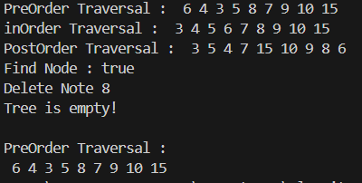

# Laporan Praktikum 15
## Praktikum 1 : Implementasi Binary Search Tree menggunakan Linked List
#### Kode Program
Class Node
```java
/**
 * Node09
 */
public class Node09 {

    int data;
    Node09 left;
    Node09 right;

    public Node09() {

    }
    public Node09(int data) {
        this.left = null;
        this.data = data;
        this.right = null;
    }
}
```
Class BinaryTree
```java
/**
 * BinaryTree09
 */
public class BinaryTree09 {

    Node09 root;

    public BinaryTree09() {
        root = null;
    }

    boolean isEmpty() {
        return root!= null;
    }

    void add(int data) {
        if (!isEmpty()) {
            root = new Node09(data);
        } else {
            Node09 current = root;
            while (true) {
                if (data > current.data) {
                    if (current.right==null) {
                        current.right = new Node09(data);
                    } else{
                        current = current.right;
                    }
                } else if (data < current.data) {
                    if (current.left == null) {
                        current.left = new Node09(data);
                    } else {
                        current = current.left;
                    }
                } else {
                    break;
                }
            }
        }
    }

    boolean find(int data) {
        boolean result = false;
        Node09 current = root;
        while (current !=null) {
            if (current.data == data) {
                result = true;
                break;
            } else if (data > current.data) {
                current = current.right;
            } else if (data < current.data) {
                current = current.left;
            }
        }
        return result;
    }

    void traversePreOrder(Node09 node) {
        if (node != null) {
            System.out.print(" " + node.data);
            traversePreOrder(node.left);
            traversePreOrder(node.right);
        }
    }

    void traversePostOrder(Node09 node) {
        if (node != null) {
            traversePostOrder(node.left);
            traversePostOrder(node.right);
            System.out.print(" " + node.data);
        }
    }

    void traverseInOrder(Node09 node) {
        if (node != null) {
            traverseInOrder(node.left);
            System.out.print(" " + node.data);
            traverseInOrder(node.right);
        }
    }

    Node09 getSuccessor(Node09 del) {
        Node09 successor = del.right;
        Node09 successorParent = del;
        while (successor.left != null) {
            successorParent = successor;
            successor  = successor.left;
        }
        if (successor != del.right) {
            successorParent.left = successor.right;
            successor.right = del.right;
        }
        return successor;
    }

    void delete(int data) {
        if (isEmpty()) {
            System.out.println("Tree is empty!");
            return;
        }
        Node09 parent = root;
        Node09 current = root;
        boolean isLeftChild = false;
        while (current != null) {
            if (current.data==data) {
                break;
            } else if (data < current.data) {
                parent = current;
                current = current.left;
                isLeftChild = true;
            } else if (data > current.data) {
                parent = current;
                current = current.right;
                isLeftChild = false;
            }
        }
        if (current==null) {
            System.out.println("Couldn't find data!");
            return;
        } else {
            if (current.left == null && current.right == null) {
                if (current == root) {
                    root = null;
                } else {
                    if (isLeftChild) {
                        parent.left = null;
                    } else {
                        parent.right = null;
                    }
                }
            } else if (current.left==null) {
                if (current==root) {
                    root = current.right;
                } else {
                    if (isLeftChild) {
                        parent.left = current.right;
                    } else {
                        parent.right = current.right;
                    }
                }
            } else {
                Node09 successor = getSuccessor(current);
                if (current==root) {
                    root = successor;
                } else {
                    if (isLeftChild) {
                        parent.left = successor;
                    } else {
                        parent.right = successor;
                    }
                    successor.left = current.left;
                }
            }
        }
    }

}
```
Class BinaryTreeMain
```java
/**
 * BinaryTreeMain09
 */
public class BinaryTreeMain09 {

    public static void main(String[] args) {
        BinaryTree09 bt = new BinaryTree09();

        bt.add(6);
        bt.add(4);
        bt.add(8);
        bt.add(3);
        bt.add(5);
        bt.add(7);
        bt.add(9);
        bt.add(10);
        bt.add(15);

        System.out.print("PreOrder Traversal : ");
        bt.traversePreOrder(bt.root);
        System.out.println();
        System.out.print("inOrder Traversal : ");
        bt.traverseInOrder(bt.root);
        System.out.println();
        System.out.print("PostOrder Traversal : ");
        bt.traversePostOrder(bt.root);
        System.out.println();
        System.out.println("Find Node : " + bt.find(5));
        System.out.println("Delete Note 8 ");
        bt.delete(8);
        System.out.println();
        System.out.println("PreOrder Traversal : ");
        bt.traversePreOrder(bt.root);
        System.out.println();
    }
}
```
#### Output


#### Pertanyaan
1. Mengapa dalam binary search tree proses pencarian data bisa lebih efektif dilakukan dibanding
binary tree biasa?
2. Untuk apakah di class Node, kegunaan dari atribut left dan right?
3. a. Untuk apakah kegunaan dari atribut root di dalam class BinaryTree?

    b. Ketika objek tree pertama kali dibuat, apakah nilai dari root?
4. Ketika tree masih kosong, dan akan ditambahkan sebuah node baru, proses apa yang akan terjadi?
5. Perhatikan method add(), di dalamnya terdapat baris program seperti di bawah ini. Jelaskan
secara detil untuk apa baris program tersebut? 

#### Jawaban
1. Binary Search Tree memungkinkan pencarian data lebih efisien dengan kompleksitas waktu logaritmik dibandingkan binary tree biasa karena struktur datanya terurut, sehingga proses pencarian dapat mengeliminasi sebagian besar data yang tidak relevan.
2. Atribut left adalah sebuah pointer yang menunjuk ke node anak kiri dari node saat ini.
Jika left bernilai null, itu berarti node saat ini tidak memiliki anak di sebelah kiri.
Atribut right adalah sebuah pointer yang menunjuk ke node anak kanan dari node saat ini.
Jika right bernilai null, itu berarti node saat ini tidak memiliki anak di sebelah kanan.
3. a. Atribut root berfungsi sebagai pointer yang menunjuk ke node akar (root node) dari binary tree tersebut.
    
    b. Saat objek BinaryTree09 baru diinisialisasi, atribut root diinisialisasi dengan nilai null. Ini mengindikasikan bahwa binary tree masih kosong dan belum memiliki node akar maupun node lainnya.
4. Node baru tersebut akan menjadi root dari tree.
5. Kode tersebut digunakan dalam proses menambahkan (insert) sebuah node baru dengan nilai data ke dalam Binary Search Tree. Tujuan utama dari baris program ini adalah untuk menemukan posisi yang tepat dalam BST di mana node baru dengan nilai data harus ditempatkan.

## Praktikum 2 : Implementasi binary tree dengan array
#### Kode Program
Class BinaryTreeArray
```java
public class BinaryTreeArray09 {
    int[] data;
    int idxLast;

    public BinaryTreeArray09() {
        data = new int [10];
    }
    void populatedData(int data[], int idxLast) {
        this.data = data;
        this.idxLast = idxLast;
    }
    
    void traverseInOrder(int idxStart) {
        if (idxStart <= idxLast) {
            traverseInOrder(2*idxStart+1);
            System.out.print(data[idxStart] + " ");
            traverseInOrder(2*idxStart+2);
        }
    }
}
```
Class BinaryTreeArrayMain
```java
public class BinaryTreeArrayMain {
    public static void main(String[] args) {
        BinaryTreeArray09 bta = new BinaryTreeArray09();
        int[] data = {6, 4, 8, 3, 5, 7, 9, 0, 0, 0};
        int idxLast = 6;
        bta.populatedData(data, idxLast);
        System.out.print("\nInOrder Traversal : ");
        bta.traverseInOrder(0);
        System.out.println("\n");
    }
}
```
#### Output


#### Pertanyaan
1. Apakah kegunaan dari atribut data dan idxLast yang ada di class BinaryTreeArray?
2. Apakah kegunaan dari method populateData()?
3. Apakah kegunaan dari method traverseInOrder()?
4. Jika suatu node binary tree disimpan dalam array indeks 2, maka di indeks berapakah posisi 
left child dan rigth child masing-masing?
5. Apa kegunaan statement int idxLast = 6 pada praktikum 2 percobaan nomor 4?
#### Jawaban
1. Atribut data digunakan untuk menyimpan nilai-nilai simpul dalam binary tree, sedangkan atribut idxLast digunakan untuk melacak indeks terakhir simpul yang valid dalam array data.
2. Untuk mengisi nilai-nilai ke dalam array data dan mengatur nilai idxLast yang mewakili indeks simpul terakhir dalam binary tree.
3. Digunakan untuk melakukan pencarian (traversal) secara in-order pada binary tree yang direpresentasikan dengan array data.
4. Jika suatu node binary tree disimpan dalam array indeks 2, Left child berada pada indeks 5 Right child berada pada indeks 6.
5. Kode tersebut digunakan untuk menginisialisasi nilai variabel idxLast yang ada di dalam kelas BinaryTreeArray09. 

## Tugas Praktikum
1. Buat method di dalam class BinaryTree yang akan menambahkan node dengan cara 
rekursif.
2. Buat method di dalam class BinaryTree untuk menampilkan nilai paling kecil dan yang 
paling besar yang ada di dalam tree.
3. Buat method di dalam class BinaryTree untuk menampilkan data yang ada di leaf.
4. Buat method di dalam class BinaryTree untuk menampilkan berapa jumlah leaf yang ada 
di dalam tree.
5. Modifikasi class BinaryTreeArray, dan tambahkan : 
    
    • method add(int data) untuk memasukan data ke dalam tree 
        
    • method traversePreOrder() dan traversePostOrder().
