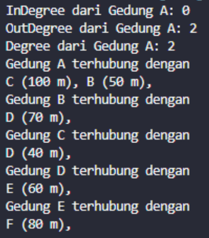
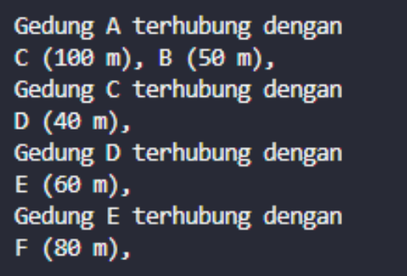
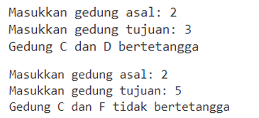
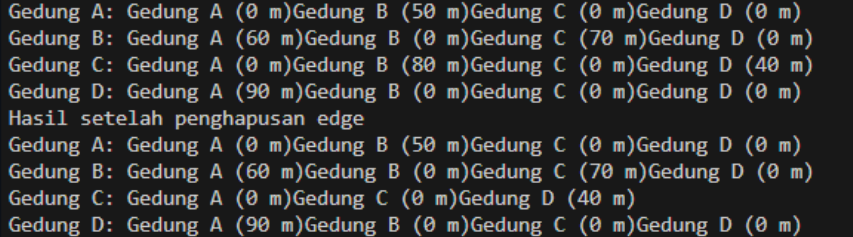
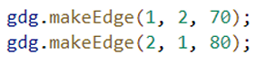

# Laporan Praktikum 15
## Praktikum 1 : Implementasi Graph menggunakan Linked List
#### Kode Program
Class Node09
```java
/**
 * Node09
 */
public class Node09 {

    int data;
    Node09 prev, next;
    int jarak;

    Node09 (Node09 prev, int data, int jarak, Node09 next) {
        this.prev = prev;
        this.data = data;
        this.next = next;
        this.jarak = jarak;
    }
}
``` 
Class DoubleLinkedList09
```java
public class DoubleLinkedList09 {
    Node09 head;
    int size;

    DoubleLinkedList09() {
        head = null;
        size = 0;
    }

    public boolean isEmpty() {
        return head == null;
    }
    public void addFirst(int item, int jarak) {
        if(isEmpty()) {
            head = new Node09(null, item, jarak, null);
        } else {
            Node09 newNode = new Node09(null, item, jarak, head);
            head.prev = newNode;
            head = newNode;
        }
        size++;
    }

    public int getJarak(int index) throws Exception {
        if(isEmpty() || index >= size) {
            throw new Exception("Nilai indeks di luar batas");
        }
        Node09 tmp = head;
        for(int i = 0; i < index; i++) {
            tmp = tmp.next;
        }
        return tmp.jarak;
    }

    public void remove(int index) {
        Node09 current = head;
        while(current != null) {
            if(current.data == index) {
                if(current.prev != null) {
                    current.prev.next = current.next;
                } else {
                    head = current.next;
                }
                if(current.next != null) {
                    current.next.prev = current.prev;
                }
                break;
            }
            current = current.next;
        }
        size--;
    }

    public int get(int index) throws Exception {
        if (index >= size) {
            throw new Exception("Nilai indeks di luar batas");
        }
        Node09 tmp = head;
        for (int i = 0; i < index; i++) {
            tmp = tmp.next;
        }
        return tmp.data;
    }

    public int size() {
        return size;
    }

    public void clear() {
        head = null;
        size = 0;
    }
}
```
Class Graph09
```java

public class Graph09 {
    int vertex;
    DoubleLinkedList09 list[];

    public Graph09(int v) {
        vertex = v; 
        list = new DoubleLinkedList09[v];
        for (int i = 0; i < v; i++) {
            list[i] = new DoubleLinkedList09();
        }
    }

    public void addEdge(int asal, int tujuan, int jarak) {
        list[asal].addFirst(tujuan, jarak);
        //list[tujuan].addFirst(asal, jarak);
    }

    public void degree(int asal) throws Exception{
        int k, totalIn = 0, totalOut=0;
        for ( int i= 0; i < vertex; i++) {
            //inDegree
            for (int j = 0 ; j <list[i].size(); j++){
                if (list [i].get(j)==asal){
                    ++totalIn;
                }
            }

            //outDegree
            for (k =0; k<list[asal].size();k++){
                list[asal].get(k);
            }
            totalOut = k;
        }    
        System.out.println("InDegree dari gedung " + (char) ('A' + asal) + ": " + totalIn);
        System.out.println("OutDegree dari gedung " + (char) ('A' + asal) + ": " + totalOut);
        System.out.println("Degree dari gedung " + (char) ('A' + asal) + ": " + (totalIn+totalOut));
       // System.out.println("OutDegree dari gedung " + (char) ('A' + asal) + ": " + list[asal].size());
        
    }

    public void removeEdge(int asal, int tujuan)throws Exception{
        for(int i = 0; i<vertex;i++){
            if (i == tujuan){
                list[asal].remove(tujuan);
            }
        }
    }
    public void removeAll(){
        for(int i = 0; i<vertex;i++){
            list[i].clear();
        }
        System.out.println("Graf berhasil dikosongkan");
    }

    public void printGraph() throws Exception{
        for(int i = 0; i<vertex;i++){
            if (list[i].size() > 0){
                System.out.println("");
                System.out.println("Gedung " + (char)('A' + i) + " terhubung dengan");
                for (int j = 0; j < list[i].size(); j++){
                    System.out.println((char)('A' + list[i].get(j)) + " (" + list[i].getJarak(j) + " m), ");
                }
                System.out.println("");
            }
        }
        System.out.println("");
    }
}
```
Class GraphMain09
```java
public class GraphMain09 {
    public static void main(String[] args)throws Exception {
        Graph09 gedung = new Graph09(6);

        gedung.addEdge(0, 1, 50);
        gedung.addEdge(0, 2, 100);
        gedung.addEdge(1, 3, 70);
        gedung.addEdge(2, 3, 40);
        gedung.addEdge(3, 4, 60);
        gedung.addEdge(4, 5, 80);
        gedung.degree(0);
        gedung.printGraph();;
        gedung.removeEdge(1, 3);
        gedung.printGraph();
    }
}
```
#### Output
Langkah 14



Langkah 17



#### Pertanyaan
1. Perbaiki kode program Anda apabila terdapat error atau hasil kompilasi kode tidak sesuai! 
2. Pada class Graph, terdapat atribut list[] bertipe DoubleLinkedList. Sebutkan tujuan pembuatan variabel tersebut! 
3. Jelaskan alur kerja dari method removeEdge! 
4. Apakah alasan pemanggilan method addFirst() untuk menambahkan data, bukan method add jenis lain saat digunakan pada method addEdge pada class Graph? 
5. Modifikasi kode program sehingga dapat dilakukan pengecekan apakah terdapat jalur antara suatu node dengan node lainnya, seperti contoh berikut (Anda dapat memanfaatkan Scanner). 

#### Jawaban
1. 
2. DoubleLinkedList09 bertujuan untuk menyimpan daftar edge (hubungan) antara vertex (node) dalam graph. 
3. Metode removeEdge(int asal, int tujuan) menghapus edge dari vertex asal menuju vertex tujuan dengan memanggil metode remove(tujuan) pada list[asal].
4. Karena dalam implementasi ini, edge disimpan dalam bentuk linked list. Dengan menggunakan addFirst(), data baru (vertex tujuan dan jarak) akan ditambahkan di awal linked list.

5. ```java
    public boolean bertetangga(int asal, int tujuan) throws Exception {
        for (int i = 0; i < list[asal].size(); i++) {
            if (list[asal].get(i) == tujuan) {
                return true;
            }
        }
        return false;
    }
    ```

    ```java
    import java.util.Scanner;

    public class GraphMain09 {
        public static void main(String[] args)throws Exception {
            Graph09 gedung = new Graph09(6);
            Scanner sc = new Scanner(System.in);

            gedung.addEdge(0, 1, 50);
            gedung.addEdge(0, 2, 100);
            gedung.addEdge(1, 3, 70);
            gedung.addEdge(2, 3, 40);
            gedung.addEdge(3, 4, 60);
            gedung.addEdge(4, 5, 80);
            gedung.degree(0);
            gedung.printGraph();;
            gedung.removeEdge(1, 3);
            gedung.printGraph();
            
            System.out.print("Masukkan gedung asal: ");
            int asal = sc.nextInt();
            System.out.print("Masukkan gedung tujuan: ");
            int tujuan = sc.nextInt();
        
            boolean tetangga = gedung.bertetangga(asal, tujuan);
            char gedungAsal = (char) ('A' + asal);
            char gedungTujuan = (char) ('A' + tujuan);
            
            if (tetangga) {
                System.out.println("Gedung " + gedungAsal + " dan " + gedungTujuan + " bertetangga");
            } else {
                System.out.println("Gedung " + gedungAsal + " dan " + gedungTujuan + " tidak bertetangga");
            }

            sc.close();
        }
    }
    ```
##  Percobaan 2: Implementasi Graph menggunakan Matriks 
#### Kode Program
Class GraphMatriks09
```java
public class GraphMatriks09 {
    int vertex;
    int [][] matriks;

    public GraphMatriks09(int v) {
        vertex = v;
        matriks = new int[v][v];
    }

    public void makeEdge(int asal, int tujuan, int jarak) {
        matriks[asal][tujuan] = jarak;
    }

    public void removeEdge(int asal, int tujuan) {
        matriks[asal][tujuan] = 0;
    }

    public void printGraph() {
        for(int i = 0; i < vertex; i++) {
            System.out.print("Gedung " + (char) ('A' + i) + ": ");
            for(int j = 0; j < vertex; j++) {
                if(matriks[i][j] != -1) {
                    System.out.print("Gedung " + (char) ('A' + j) + " (" + matriks[i][j] + " m), ");
                }
            }
            System.out.println();
        }
    }
}
```
Class GraphMain
```java
 GraphMatriks09 gdg = new GraphMatriks09(4);
        gdg.makeEdge(0, 1, 50);
        gdg.makeEdge(1, 0, 60);
        gdg.makeEdge(1, 2, 70);
        gdg.makeEdge(2, 1, 80);
        gdg.makeEdge(2, 3, 40);
        gdg.makeEdge(3, 0, 90);
        gdg.printGraph();
        System.out.println("Hasil setelah penghapusan edge");
        gdg.removeEdge(2, 1);
        gdg.printGraph();
```
#### Output


#### Pertanyaan
1. Perbaiki kode program Anda apabila terdapat error atau hasil kompilasi kode tidak sesuai! 
2. Apa jenis graph yang digunakan pada Percobaan 2? 
3. Apa maksud dari dua baris kode berikut? 

    
4. Modifikasi kode program sehingga terdapat method untuk menghitung degree, termasuk inDegree dan outDegree! 

#### Jawaban
1. 
2. Yang digunakan pada percobaan 2 adalah Graph Matriks
3. Dua baris kode tersebut membuat koneksi dua arah antara gedung B dan gedung C dengan jarak yang berbeda.
4. Berikut hasil modifikasi.
    ```java
    public void degree(int asal) throws Exception {
        int inDegree = 0, outDegree = 0;
        for (int i = 0; i < vertex; i++) {
          // inDegree
          for (int j = 0; j < list[i].size(); j++) {
            if (list[i].get(j) == asal) {
              inDegree++;
            }
          }
    
          // outDegree
          for (int k = 0; k < list[asal].size(); k++) {
            outDegree++;
          }
        }
    
        System.out.println("InDegree dari gedung " + (char) ('A' + asal) + ": " + inDegree);
        System.out.println("OutDegree dari gedung " + (char) ('A' + asal) + ": " + outDegree);
        System.out.println("Degree dari gedung " + (char) ('A' + asal) + ": " + (inDegree + outDegree));
    }
    ```

## Latihan Praktikum
1. Modifikasi kode program pada class GraphMain sehingga terdapat menu program yang bersifat dinamis, setidaknya terdiri dari:  
- a) Add Edge 
- b) Remove Edge 
- c) Degree 
- d) Print Graph 
- e) Cek Edge Pengguna dapat memilih menu program melalui input Scanner 
#### Jawaban
```java
import java.util.Scanner;

public class GraphMain09 {
  public static void main(String[] args) throws Exception {
    Scanner sc = new Scanner(System.in);
    Graph09 gedung = new Graph09(6);

    // Menu program
    int pilihan;
    do {
      System.out.println("\nMenu Graf:");
      System.out.println("1. Add Edge");
      System.out.println("2. Remove Edge");
      System.out.println("3. Degree");
      System.out.println("4. Print Graph");
      System.out.println("5. Cek Edge");
      System.out.println("0. Keluar");
      System.out.print("Masukkan pilihan: ");
      pilihan = sc.nextInt();

      switch (pilihan) {
        case 1: // Add Edge
          System.out.print("Masukkan gedung asal: ");
          int asal = sc.nextInt();
          System.out.print("Masukkan gedung tujuan: ");
          int tujuan = sc.nextInt();
          System.out.print("Masukkan jarak: ");
          int jarak = sc.nextInt();
          gedung.addEdge(asal, tujuan, jarak);
          break;

        case 2: // Remove Edge
          System.out.print("Masukkan gedung asal: ");
          asal = sc.nextInt();
          System.out.print("Masukkan gedung tujuan: ");
          tujuan = sc.nextInt();
          gedung.removeEdge(asal, tujuan);
          break;

        case 3: // Degree
          System.out.print("Masukkan gedung: ");
          int gedungIndex = sc.nextInt();
          gedung.degree(gedungIndex);
          break;

        case 4: // Print Graph
          gedung.printGraph();
          break;

        case 5: // Cek Edge
          System.out.print("Masukkan gedung asal: ");
          asal = sc.nextInt();
          System.out.print("Masukkan gedung tujuan: ");
          tujuan = sc.nextInt();
          boolean tetangga = gedung.bertetangga(asal, tujuan);
          char gedungAsal = (char) ('A' + asal);
          char gedungTujuan = (char) ('A' + tujuan);

          if (tetangga) {
            System.out.println("Gedung " + gedungAsal + " dan " + gedungTujuan + " bertetangga");
          } else {
            System.out.println("Gedung " + gedungAsal + " dan " + gedungTujuan + " tidak bertetangga");
          }
          break;

        case 0: // Keluar
          System.out.println("Keluar dari program.");
          break;

        default:
          System.out.println("Pilihan tidak valid!");
      }
    } while (pilihan != 0);

    sc.close();
  }
}
```

2. Tambahkan method updateJarak pada Percobaan 1 yang digunakan untuk mengubah jarak antara dua node asal dan tujuan! 
#### Jawaban
```java
// latihan no 2
    public void updateJarak(int asal, int tujuan, int jarakBaru) throws Exception {
        Node09 current = list[asal].head;
        while (current != null) {
          if (current.data == tujuan) {
            current.jarak = jarakBaru;
            break;
          }
          current = current.next;
        }
      }
```

3. Tambahkan method hitungEdge untuk menghitung banyaknya edge yang terdapat di dalam graf!
```java
// latihan no 3
      public int hitungEdge() {
        int totalEdge = 0;
        for (int i = 0; i < vertex; i++) {
          totalEdge += list[i].size();
        }
        return totalEdge;
      }
``` 


