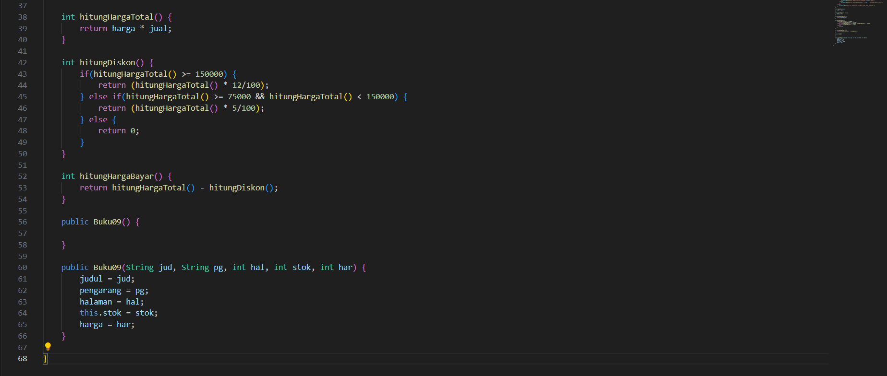

# Laporan Praktikum 2

## Percobaan 1: Deklarasi Class, Atribut dan Method
#### Kode Program

#### Hasil run

#### Pertanyaan
1. Sebutkan dua karakteristik class atau object!
2. Perhatikan class Buku pada Praktikum 1 tersebut, ada berapa atribut yang dimiliki oleh class 
Buku? Sebutkan apa saja atributnya!
3. Ada berapa method yang dimiliki oleh class tersebut? Sebutkan apa saja methodnya!
4. Perhatikan method terjual() yang terdapat di dalam class Buku. Modifikasi isi method tersebut 
sehingga proses pengurangan hanya dapat dilakukan jika stok masih ada (lebih besar dari 0)!
5. Menurut Anda, mengapa method restock() mempunyai satu parameter berupa bilangan int?
6. Commit dan push kode program ke Github

#### Jawaban
1. Atribute dan Method.
2. Ada 5. Yaitu judul, pengarang, halaman, stok, dan harga.
3. ada 4 method. Yaitu tampilInformasi():, terjual(int jml):, restock(int jml):, gantiHarga(int hrg):

4. 
5. untuk menambah stok buku. Logikanya, jumlah buku yang akan di-restock pasti berupa angka/bilangan bulat, sehingga tipe data int sudah tepat merepresentasikan jumlah buku yang di-restock.
6. -

## Percobaan 2: Instansiasi Object, serta Mengakses Atribut dan Method
#### Kode Program

#### Hasil run

#### Pertanyaan
1. Pada class BukuMain, tunjukkan baris kode program yang digunakan untuk proses instansiasi!
Apa nama object yang dihasilkan?
2. Bagaimana cara mengakses atribut dan method dari suatu objek?
3. Mengapa hasil output pemanggilan method tampilInformasi() pertama dan kedua berbeda?

#### Jawaban 
1.  
nama objek yang dihasilkan dari proses instansiasi kelas Buku09 adalah bk1

2. dengan menggunakan simbol titik (.) setelah nama objek tersebut.

3. karena nilai kondisi objek bk1 telah berubah setelah pemanggilan method lain. Pada saat pertama kali dipanggil, method tampilInformasi() menampilkan informasi atribut objek bk1 yang masih memiliki nilai awal:

    judul : Today Ends Tomorrow Comes

    pengarang : Denanda Pratiwi

    halaman : 198

    stok : 13

    harga : 71000

    Lalu setelah itu objek bk1 memanggil method terjual(5) yang mengubah nilai stok menjadi 13 - 5 = 8. Dan method gantiHarga(60000) juga mengubah nilai attribute harga menjadi 60.000.

## Percobaan 3: Membuat Konstruktor
#### Kode Program Buku.java

#### Kode Program BukuMain.java

#### Hasil run

#### Pertanyaan
1. Pada class Buku di Percobaan 3, tunjukkan baris kode program yang digunakan untuk 
mendeklarasikan konstruktor berparameter!
2. Perhatikan class BukuMain. Apa sebenarnya yang dilakukan pada baris program berikut?
3. Hapus konstruktor default pada class Buku, kemudian compile dan run program. Bagaimana 
hasilnya? Jelaskan mengapa hasilnya demikian!
4. Setelah melakukan instansiasi object, apakah method di dalam class Buku harus diakses 
secara berurutan? Jelaskan alasannya!
5. Buat object baru dengan nama buku(NamaMahasiswa) menggunakan konstruktor 
berparameter dari class Buku!
6. Commit dan push kode program ke Github

#### Jawaban
1. Baris kodenya adalah berikut 
   
2. Kode tersebut membuat object baru bk2 dari kelas Buku09, dan nilai atributnya diisi langsung saat pembuatan object menggunakan konstruktor berparameter.
3. Program tidak dapat di run/error. Karena konstruktor default diperlukan untuk inisialisasi objek. Tanpa adanya konstruktor default, objek tidak dapat dibuat karena tidak bisa diinisialisasi dengan benar.
4. Tidak. Saat instansiasi object dari sebuah class, semua data (attributes) dan method siap digunakan. Tidak ada aturan bahwa method tertentu harus diakses lebih dulu.
5. Kode Program 
   

   Hasil run

   

##  Latihan Praktikum
#### Latihan Praktikum 1
Kode Program

Hasil run

#### Latihan Praktikum 2
Kode Program

Hasil Run

