# Laporan Praktikum 3
## Percobaan 1: Membuat Array dari Object, Mengisi dan Menampilkan
#### Kode Program

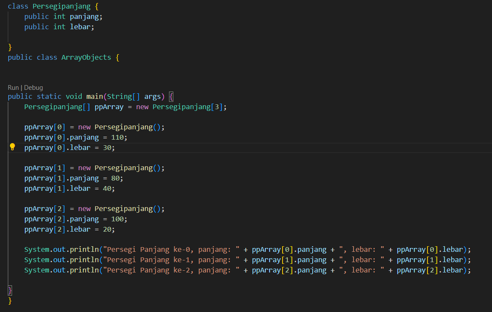

#### Hasil Run

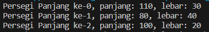

#### Pertanyaan
1. Berdasarkan uji coba 3.2, apakah class yang akan dibuat array of object harus selalu memiliki
atribut dan sekaligus method?Jelaskan!
2. Apakah class PersegiPanjang memiliki konstruktor?Jika tidak, kenapa dilakukan pemanggilan
konstruktur pada baris program berikut :
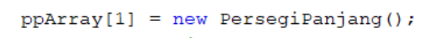
3. Apa yang dimaksud dengan kode berikut ini:

4. Apa yang dimaksud dengan kode berikut ini:
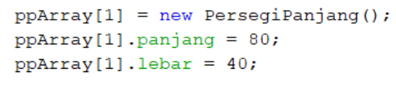
5. Mengapa class main dan juga class PersegiPanjang dipisahkan pada uji coba 3.2?

#### Jawaban
1. Tidak, kebutuhan akan atribut dan method tergantung tujuan dan fungsionalitas array of object yang ingin dibuat. Yang penting class bisa di-instansiasi menjadi object, maka class tersebut bisa digunakan untuk membuat array of object.
2. class PersegiPanjang tidak memiliki deklarasi konstruktor. Ini sebenarnya memanggil konstruktor default tanpa parameter dari class PersegiPanjang untuk membuat objek baru dan menyimpannya ke dalam array ppArray pada indeks ke-1.
3. Kode tersebut merupakan deklarasi array kosong dengan kapasitas 3, yang nantinya bisa diisi dengan objek-objek PersegiPanjang
4. Kode tersebut berfungsi untuk mengisi nilai untuk atribut panjang dan lebar pada objek PersegiPanjang yang baru dibuat tersebut.
5. 

## Percobaan 2: Menerima Input Isian Array Menggunakan Looping
#### Kode Program

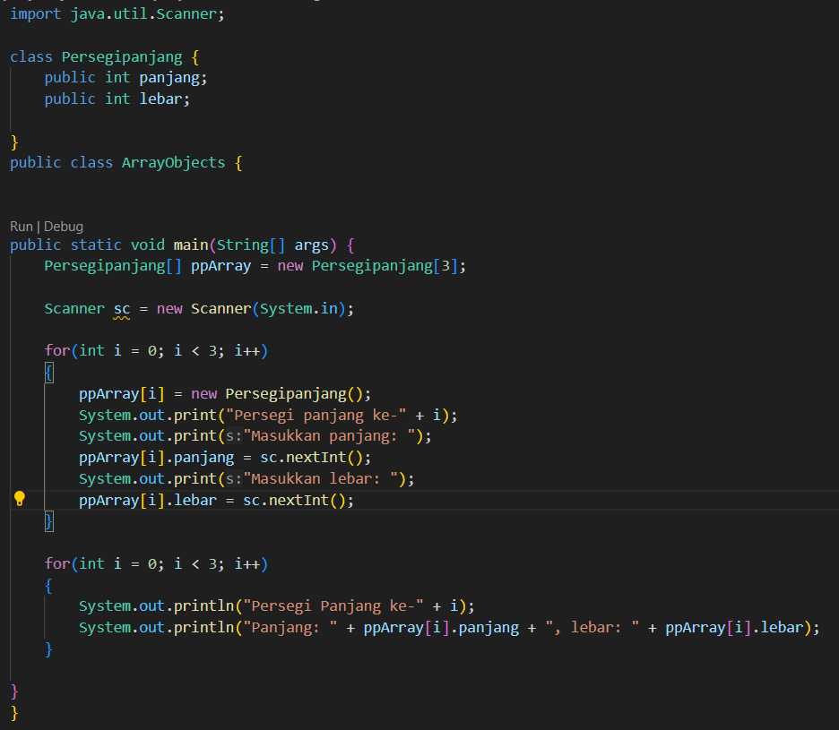

#### Hasil run

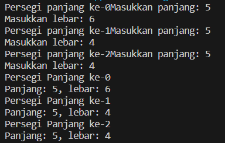

#### Pertanyaan
1. Apakah array of object dapat diimplementasikan pada array 2 Dimensi?
2. Jika jawaban soal no satu iya, berikan contohnya! Jika tidak, jelaskan!
3. Jika diketahui terdapat class Persegi yang memiliki atribut sisi bertipe integer, maka kode dibawah ini akan memunculkan error saat dijalankan. Mengapa?
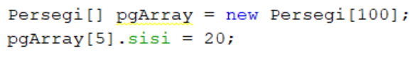
4. Modifikasi kode program pada praktikum 3.3 agar length array menjadi inputan dengan Scanner!
5. Apakah boleh Jika terjadi duplikasi instansiasi array of objek, misalkan saja instansiasi dilakukan
pada ppArray[i] sekaligus ppArray[0]?Jelaskan !

#### Jawaban
1. Bisa, array of object bisa diterapkan baik pada array 1 dimensi maupun 2 dimensi, atau bahkan lebih, sesuai kebutuhan program.

2. 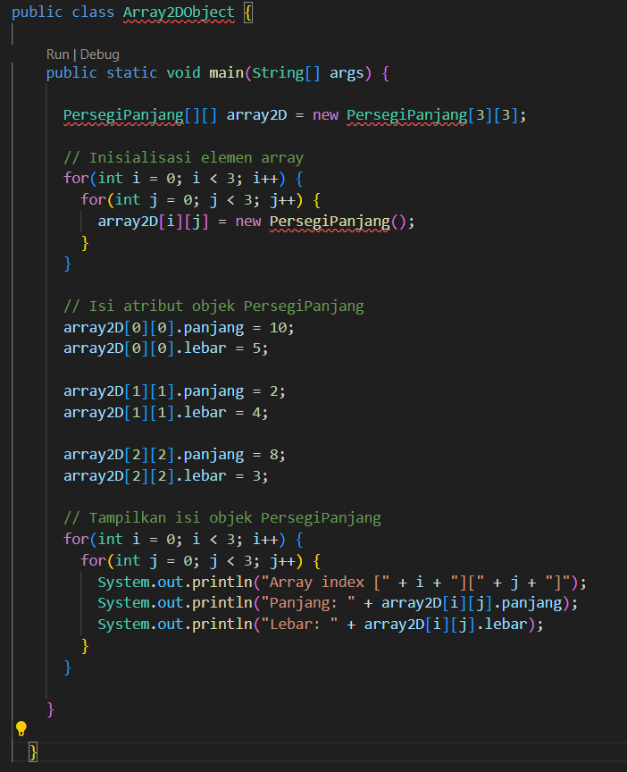
3. Kode tersebut akan menghasilkan error NullPointerException saat dijalankan karena objek Persegi pada elemen indeks 5 masih bernilai null.
4. Berikut adalah hasil dari modifikasi kode program 
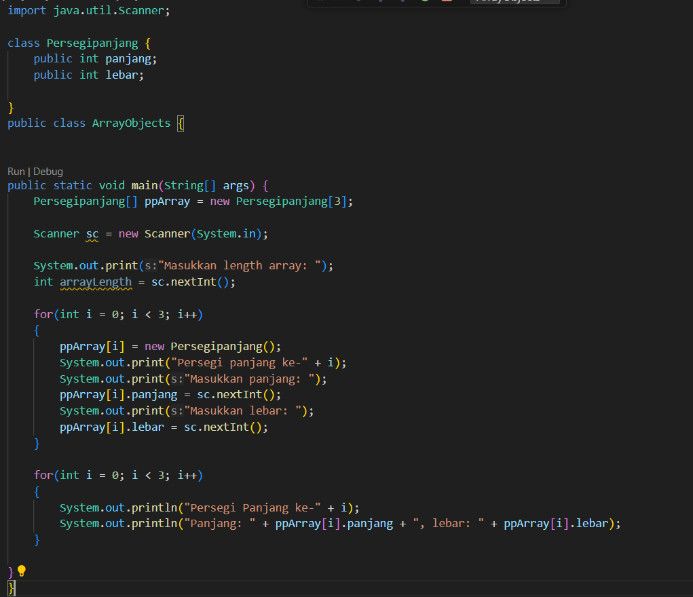
5. Duplikasi instansiasi seperti itu diperbolehkan. Tetapi melakukan duplikasi instansiasi ke index array yang sama akan menimpa objek sebelumnya, sehingga mengakibatkan borosnya memori.

## Percobaan 3: Penambahan Operasi Matematika di Dalam Method
#### Kode Program

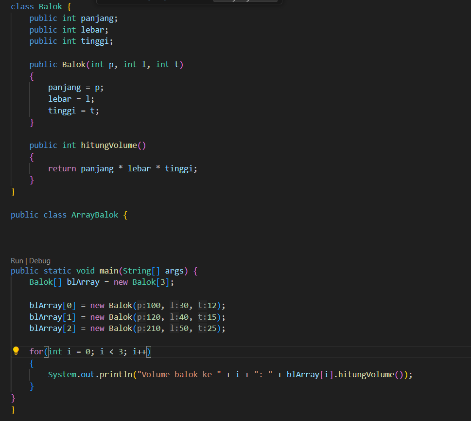

#### Hasil run

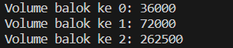

#### Pertanyaan
1. Dapatkah konstruktor berjumlah lebih dalam satu kelas? Jelaskan dengan contoh!
2. Jika diketahui terdapat class Segitiga seperti berikut ini:
Tambahkan konstruktor pada class Segitiga tersebut yang berisi parameter int a, int t
yang masing-masing digunakan untuk mengisikan atribut alas dan tinggi.
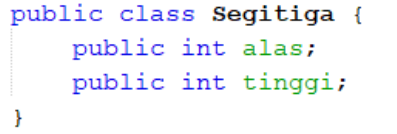
3. Tambahkan method hitungLuas() dan hitungKeliling() pada class Segitiga
tersebut. Asumsi segitiga adalah segitiga siku-siku. (Hint: Anda dapat menggunakan bantuan
library Math pada Java untuk mengkalkulasi sisi miring)
4. Pada fungsi main, buat array Segitiga sgArray yang berisi 4 elemen, isikan masing-masing
atributnya sebagai berikut:
    
5. Kemudian menggunakan looping, cetak luas dan keliling dengan cara memanggil method
hitungLuas() dan hitungKeliling().

#### Jawaban
1. Bisa, dalam Java sebuah kelas dapat memiliki lebih dari satu konstruktor.
berikut contohnya,
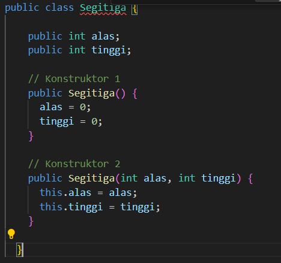

2. 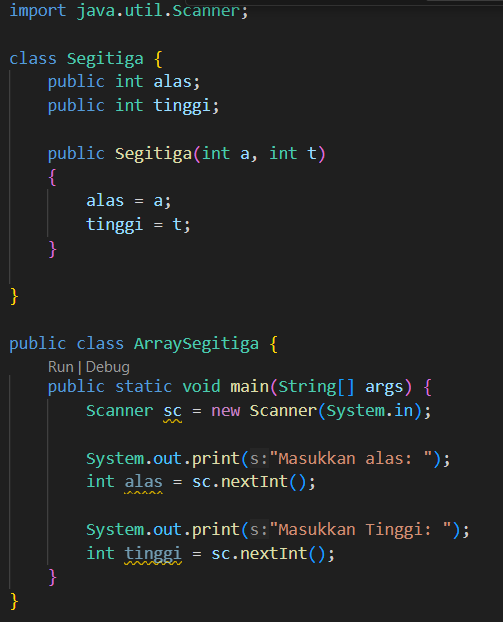

3. Tambahkan method hitungLuas() dan hitungKeliling() pada class Segitiga
    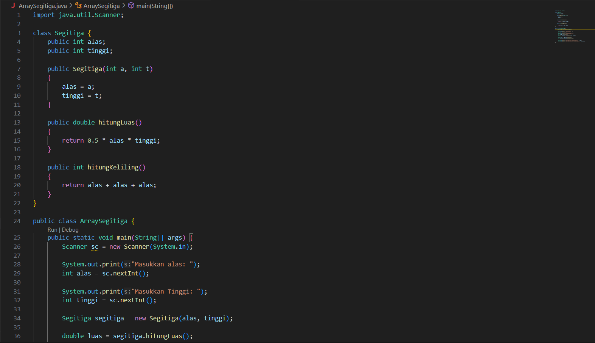
    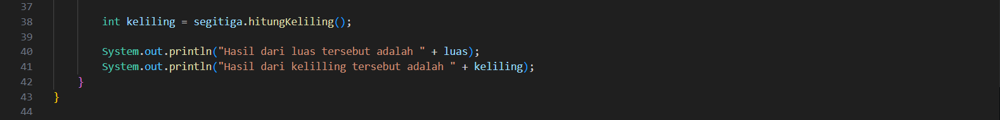

4. buat array Segitiga sgArray yang berisi 4 elemen, isikan masing-masing
atributnya
    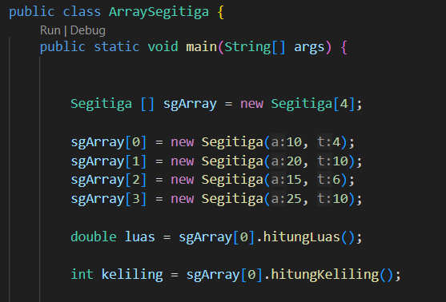

5. Kemudian menggunakan looping
    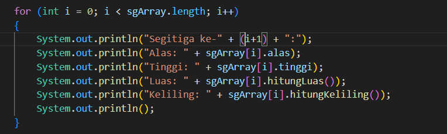

## Latihan Praktikum
#### Latihan 1
