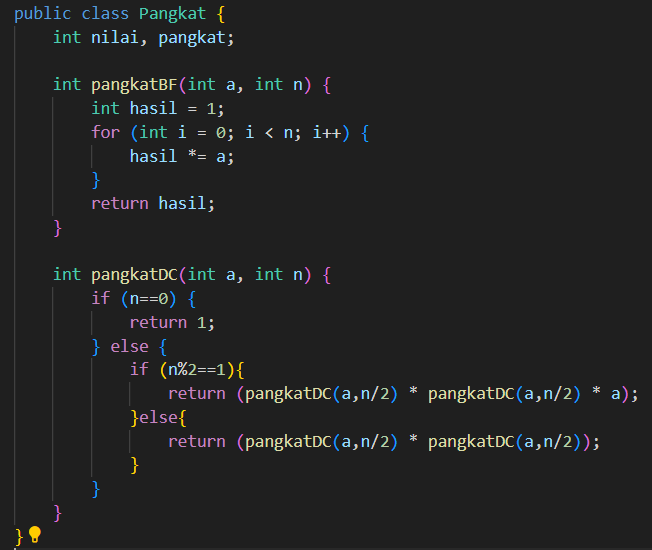

# Laporan Praktikum 4
## Percobaan 1 : Menghitung Nilai Faktorial dengan Algoritma Brute Force dan Divide and Conquer
#### Kode program
Faktorial

Main Faktorial

#### Hasil Run

#### Pertanyaan
1. Pada base line Algoritma Divide Conquer untuk melakukan pencarian nilai faktorial, jelaskan
perbedaan bagian kode pada penggunaan if dan else!
2. Apakah memungkinkan perulangan pada method faktorialBF() dirubah selain menggunakan
for?Buktikan!
3. Jelaskan perbedaan antara fakto *= i; dan int fakto = n * faktorialDC(n-1); !

#### Jawaban
1. if menangani kasus base case di mana fungsi dapat mengembalikan nilai faktorial secara langsung. Sementara else menangani kasus rekursif dimana fungsi membagi masalah menjadi submasalah yang lebih kecil, menghitung faktorial dari submasalah tersebut, dan kemudian menggabungkan hasilnya untuk mendapatkan faktorial dari masalah awal.
2. Ya, memungkinkan untuk mengubah perulangan pada metode faktorialBF() selain menggunakan perulangan for. Kita dapat menggunakan perulangan while atau do-while.

3. fakto *= i; merupakan operasi iteratif dalam pendekatan Brute Force untuk menghitung faktorial.

    int fakto = n * faktorialDC(n-1); merupakan operasi rekursif dalam pendekatan Divide and Conquer untuk menghitung faktorial, di mana masalah dibagi menjadi submasalah yang lebih kecil, diselesaikan secara rekursif, dan kemudian digabungkan untuk mendapatkan solusi akhir.

## Percobaan 2 : Menghitung Hasil Pangkat dengan Algoritma Brute Force dan Divide and Conquer
#### Kode program
Pangkat

Main Pangkat

#### Hasil run

#### Pertanyaan
1. Jelaskan mengenai perbedaan 2 method yang dibuat yaitu PangkatBF() dan PangkatDC()!
2. Apakah tahap combine sudah termasuk dalam kode tersebut?Tunjukkan!
3. Modifikasi kode program tersebut, anggap proses pengisian atribut dilakukan dengan
konstruktor.
4. Tambahkan menu agar salah satu method yang terpilih saja yang akan dijalankan menggunakan
switch-case!

#### Jawaban
1. Metode pangkatBF() mengimplementasikan algoritma brute force untuk menghitung hasil pangkat suatu bilangan. Metode pangkatDC() mengimplementasikan algoritma divide and conquer untuk menghitung hasil pangkat suatu bilangan.
2. Dalam implementasi algoritma divide and conquer pada metode pangkatDC() yang diberikan, tahap combine (penggabungan) sudah termasuk di dalamnya.

3. Modifikasi konstruktor
    
    pangkat
  
    main
  

4. Modifikasi menambahkan menu

    pangkat 
    
    main
    

## Percobaan 3 : Menghitung Sum Array dengan Algoritma Brute Force dan Divide and Conquer
#### Kode program
Sum

MainSum

#### Hasil run

#### Pertanyaan
1. Mengapa terdapat formulasi return value berikut?Jelaskan!

2. Kenapa dibutuhkan variable mid pada method TotalDC()?
3. Program perhitungan keuntungan suatu perusahaan ini hanya untuk satu perusahaan saja.
Bagaimana cara menghitung sekaligus keuntungan beberapa bulan untuk beberapa
perusahaan.(Setiap perusahaan bisa saja memiliki jumlah bulan berbeda-beda)? Buktikan
dengan program!

#### Jawaban
1. formulasi return lsum + rsum + arr[mid]; digunakan dalam metode totalDC yang mengimplementasikan algoritma divide and conquer untuk menghitung total dari sebuah array.
2. Variabel mid digunakan untuk membagi array menjadi dua bagian, yaitu bagian kiri dan bagian kanan.
3. Dengan memodifikasi kode yang ada dengan menggunakan struktur data yang lebih kompleks, seperti array dua dimensi atau ArrayList dari ArrayList. Berikut adalah contoh program untuk menyimpan keuntungan dari beberapa perusahaan dengan jumlah bulan yang berbeda-beda

## Latihan Praktikum
1. Sebuah showroom memiliki daftar mobil dengan data sesuai tabel di bawah ini

Tentukan:

a). top_acceleration tertinggi menggunakan Divide and Conquer!

b). top_acceleration terendah menggunakan Divide and Conquer!

c). Rata-rata top_power dari seluruh mobil menggunakan Brute Force!

## Jawaban
#### Kode program
Latihan

MainLatihan

#### Hasil run
