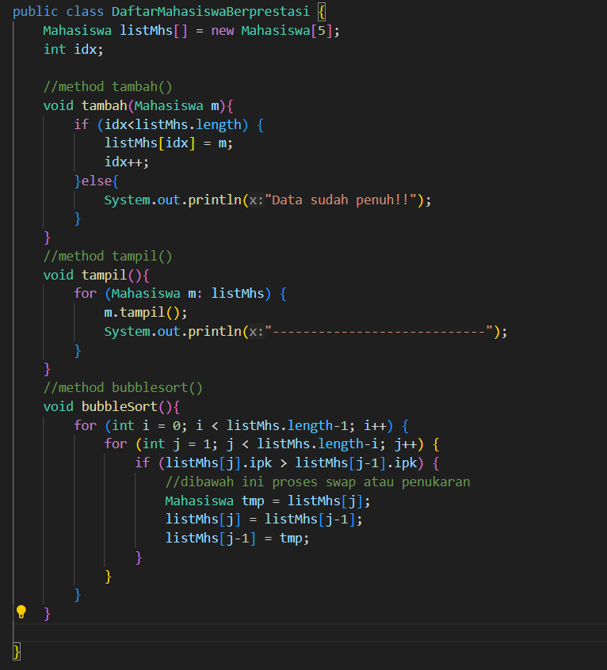
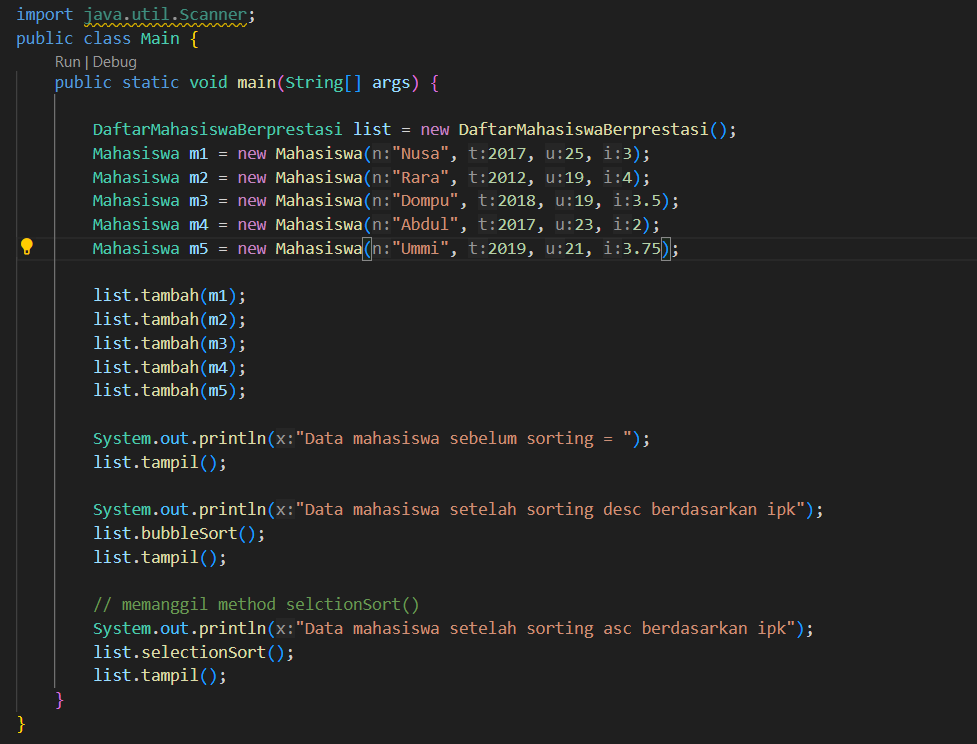

# Laporan Praktikum 6
## Percobaan 1 : Mengurutkan Data Mahasiswa Berdasarkan IPK Menggunakan Bubble Sort
#### Kode program
Mahasiswa

DaftarMahasiswaBerprestasi

Main

#### Hasil run

#### Pertanyaan
1. Terdapat di method apakah proses bubble sort?
2. Di dalam method bubbleSort(), terdapat baris program seperti di bawah ini:

Untuk apakah proses tersebut?

3. Perhatikan perulangan di dalam bubbleSort() di bawah ini:

    a. Apakah perbedaan antara kegunaan perulangan i dan perulangan j?
    
    b. Mengapa syarat dari perulangan i adalah i<listMhs.length-1 ?
    
    c. Mengapa syarat dari perulangan j adalah j<listMhs.length-i ?
    
    d. Jika banyak data di dalam listMhs adalah 50, maka berapakali     perulangan i akan berlangsung? Dan ada berapa Tahap bubble sort yang ditempuh?  

#### Jawaban
1. Proses algoritma bubble sort terdapat di dalam method bubbleSort() pada class DaftarMahasiswaBerprestasi.
2. untuk proses penukaran(swap) antara dua elemen yang bersebelahan dalam array listMhs.
3.  a. Perulangan i berfungsi untuk mengontrol jumlah iterasi utama atau putaran yang dilakukan dalam proses pengurutan. Sedangkan Perulangan j berfungsi untuk membandingkan setiap pasangan elemen yang bersebelahan dalam array pada setiap iterasi utama.

    b. Karena dalam algoritma Bubble Sort hanya membutuhkan n-1 iterasi utama untuk mengurut array dengan panjang n.

    c. Karena dalam algoritma Bubble Sort syarat tersebut bertujuan untuk mengoptimalkan proses pengurutan dan menghindari membandingkan elemen-elemen yang sudah terurut pada setiap iterasi utama (i).

    d. Jika banyak data di dalam listMhs adalah 50 maka perulangan i akan berlangsung sebanyak 49 kali. Karena dalam kasus ini, n adalah 50, sehingga perulangan i akan berlangsung dari i = 0 hingga i = 48 (total 49 iterasi).

## Percobaan 2 : Mengurutkan Data Mahasiswa Berdasarkan IPK Menggunakan Selection Sort
#### Kode program
DaftarMahasiswaBerprestasi

Main

#### Hasil run

#### Pertanyaan
Di dalam method selection sort, terdapat baris program seperti di bawah ini:

Untuk apakah proses tersebut, jelaskan!

#### Jawaban
Proses tersebut digunakan untuk mencari indeks elemen dengan nilai ipk terkecil di antara elemen-elemen yang belum terurut dalam array listMhs.

## Percobaan 3 : Mengurutkan Data Mahasiswa Berdasarkan IPK Menggunakan Insertion Sort
#### Kode program
DaftarMahasiswaBerprestasi

Main

#### Hasil run

#### Pertanyaan
Ubahlah fungsi pada InsertionSort sehingga fungsi ini dapat melaksanakan proses sorting
dengan cara descending.

#### Jawaban

perubahan terdapat pada baris while

## Latihan Praktikum
#### Pertanyaan
Sebuah platform travel yang menyediakan layanan pemesanan kebutuhan travelling sedang
mengembangkan backend untuk sistem pemesanan/reservasi akomodasi (penginapan), salah
satu fiturnya adalah menampilkan daftar penginapan yang tersedia berdasarkan pilihan filter
yang diinginkan user. Daftar penginapan ini harus dapat disorting berdasarkan
1. Harga dimulai dari harga termurah ke harga tertinggi.
2. Rating bintang penginapan dari bintang tertinggi (5) ke terendah (1)

Buatlah proses sorting data untuk kedua filter tersebut dengan menggunakan algoritma
bubble sort dan selection sort. 

#### Jawaban
###### Kode Program
Hotel

HotelService

MainHotel

###### Hasil run

