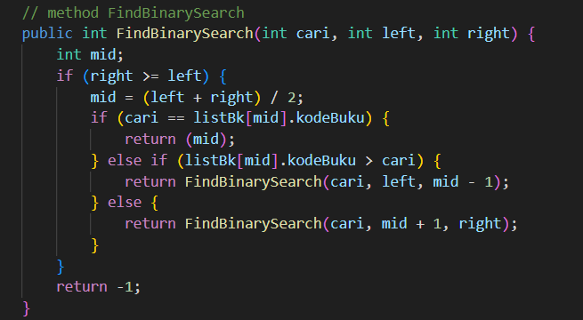

# Laporan Praktikum 7
## Percobaan 1 : Searching / Pencarian Menggunakan Agoritma Sequential Search
#### Kode program
Buku


PencarianBuku


BukuMain


Buatlah method TampilData bertipe void pada class PencarianBukuNoAbsen dan
tambahkan isi dari method TampilData.


#### Hasil run


Jika data tidak ditemukan :


#### Pertanyaan
1. Jelaskan fungsi break yang ada pada method FindSeqSearch!
2. Jika Data Kode Buku yang dimasukkan tidak terurut dari kecil ke besar. Apakah program masih
dapat berjalan? Apakah hasil yang dikeluarkan benar? Tunjukkan hasil screenshoot untuk bukti
dengan kode Buku yang acak. Jelaskan Mengapa hal tersebut bisa terjadi?
3. Buat method baru dengan nama FindBuku menggunakan konsep sequential search dengan tipe
method dari FindBuku adalah BukuNoAbsen. Sehingga Anda bisa memanggil method
tersebut pada class BukuMain seperti gambar berikut :

    

#### Jawaban
1. Break pada FindSeqSearch berfungsi untuk menghentikan perulangan segera setelah nilai yang dicari ditemukan.
2. Program dapat berjalan, tetapi hasil yang dikeluarkan memungkinkan untuk tidak sesuai dengan yang diinginkan.

 

    hal ini dapat terjadi karena FindSeqSearch menggunakan algoritma pencarian sekuensial. Algoritma ini tidak memerlukan data yang terurut terlebih dahulu. Tetapi jika data tidak terurut, maka pencarian mungkin tidak menemukan nilai terbesar atau terkecil jika terdapat nilai yang sama dalam array.

3. Kode Program pada PencarianBuku09
    

    Kode Program pada BukuMain09
    

## Percobaan 2 : Searching / Pencarian Menggunakan Binary Search
#### Kode program
PencarianBuku


BukuMain


#### Hasil run


#### Pertanyaan
1. Tunjukkan pada kode program yang mana proses divide dijalankan!
2. Tunjukkan pada kode program yang mana proses conquer dijalankan!
3. Jika data Kode Buku yang dimasukkan tidak urut. Apakah program masih dapat berjalan? Mengapa
demikian! Tunjukkan hasil screenshoot untuk bukti dengan kode Buku yang acak. Jelaskan
Mengapa hal tersebut bisa terjadi?
4. Jika Kode Buku yang dimasukkan dari Kode Buku terbesar ke terkecil (missal : 20215, 20214, 20212, 20211, 20210) dan elemen yang dicari adalah 20210. Bagaimana hasil dari binary search?
Apakah sesuai? Jika tidak sesuai maka ubahlah kode program binary seach agar hasilnya sesuai!

#### Jawaban
1. Proses divide berada di kode program berikut


2. Proses conquer berada di kode program berikut


3. Jika data Kode Buku yang dimasukkan tidak urut, maka metode FindBinarySearch pada program tersebut tidak akan berfungsi dengan benar.Karena algoritma binary search mengharuskan data yang akan dicari sudah diurutkan terlebih dahulu.


4. Hasil dari metode binary search tidak sesuai.


    maka kode harus dirubah seperti berikut
    


## Percobaan 3 : Percobaan Pengayaan Divide and Conquer
#### Kode program
MergeSorting


SortMain


#### Hasil run


## Latihan Praktikum
Buku
```java
/**
 * Buku
 */
public class Buku09 {
    String kodeBuku;
    String judulBuku;
    int tahunTerbit;
    String pengarang;
    int stock;

    Buku09 (String kB, String jB, int tT, String p, int s) {
        this.kodeBuku = kB;
        this.judulBuku = jB;
        this.tahunTerbit = tT;
        this.pengarang = p;
        this.stock = s;
    }

    void tampilDataBuku() {
        System.out.println("========================");
        System.out.println("Kode buku :"+kodeBuku);
        System.out.println("Judul buku :"+judulBuku);
        System.out.println("Tahun terbit :"+tahunTerbit);
        System.out.println("Pengarang :"+pengarang);
        System.out.println("Stock :"+stock);
    }
}
```
PencarianBuku
```java
public class PencarianBuku09 {
    Buku09 [] listBK = new Buku09[5];
    int idx;

    void tambahBuku( Buku09 m){
        if(idx < listBK.length){
            listBK[idx]=m;
            idx++;
        }else{
            System.out.println("Data Sudah Penuh");
        }
    }

    public void tampil(){
        for (Buku09 m : listBK){
            m.tampilDataBuku();
        }
    }

    public int FindSeqSearch(String cari){
        int posisi = -1;
        for (int j = 0 ; j <listBK.length; j++){
            if (listBK[j].kodeBuku.equals(cari)){
                posisi = j;
                break;
            }    
        }
        return posisi;
    }
    
    public void tampilPosisi(String x, int pos) { 
        if (pos != -1) {
            System.out.println("Data: "+ x +" ditemukan pada indeks "+ pos);
        } else {
            System.out.println("Data: "+ x + " tidak ditemukan!");
        }
    }

    public void TampilData (String x, int pos){
        if (pos != -1){
            System.out.println("Kode Buku : " + x);
            System.out.println("Judul : " + listBK[pos].judulBuku);
            System.out.println("Tahun Terbit : " + listBK[pos].tahunTerbit);
            System.out.println("Pengarang : " + listBK[pos].pengarang);
            System.out.println("Stok : " + listBK[pos].stock);
        }else {
            System.out.println("Data " + x + " tidak ditemukan!!");
        }
    }

  
    public Buku09 FindBuku(String cari) {
        int posisi =-1;
        for (int j = 0; j < listBK.length; j++) {
            if (listBK[j].kodeBuku.equals(cari)) {
                posisi = j;
                break;

            }
        }
        return listBK[posisi];
    }

    public int FindBinarySearch(String cari, int left, int right){
        int mid;
        if (right >= left){
            mid = left + (right - left) / 2;
            if ( cari.equals(listBK[mid].kodeBuku)){
                return mid;
            }else if (listBK[mid].kodeBuku.compareTo(cari) > 0){
                return FindBinarySearch(cari, left, mid -1);
            }else {
                return FindBinarySearch (cari, mid +1, right);
            }
        }
        return -1;
    }

    public int findJudulSequential(String judul) {
        int posisi = -1;
        for (int j = 0; j < listBK.length; j++) {
            if (listBK[j].judulBuku.equals(judul)) {
                posisi = j;
                break;
            }
        }
        return posisi;
    }

    private void bubbleSortByJudul() {
        for (int i = 0; i < listBK.length - 1; i++) {
            for (int j = 0; j < listBK.length - i - 1; j++) {
                if (listBK[j].judulBuku.compareTo(listBK[j + 1].judulBuku) > 0) {
                    Buku09 temp = listBK[j];
                    listBK[j] = listBK[j + 1];
                    listBK[j + 1] = temp;
                }
            }
        }
    }

    public int findJudulBinary(String judul) {
        bubbleSortByJudul(); 
        int left = 0;
        int right = listBK.length - 1;
        while (left <= right) {
            int mid = left + (right - left) / 2;
            int compareResult = listBK[mid].judulBuku.compareTo(judul);
            if (compareResult == 0) {
                return mid;
            } else if (compareResult < 0) {
                left = mid + 1;
            } else {
                right = mid - 1;
            }
        }
        return -1;    
    }
}
```

BukuMain
```java
import java.util.Scanner;
public class BukuMain09 {
    public static void main(String[] args) {
        Scanner s = new Scanner(System.in);
        Scanner s1 = new Scanner(System.in);

        PencarianBuku09 data = new PencarianBuku09();
        int jumBuku = 5;

        System.out.println("---------------------------------------");
        System.out.println("Masukan data buku secara urut dari kode buku terkecil : ");
        for (int i = 0; i < jumBuku; i++) {
            System.out.println("---------------------");
            System.out.print("Kode Buku : ");
            String kodeBuku = s1.nextLine();
            System.out.print("Judul  Buku : ");
            String judulBuku = s1.nextLine();
            System.out.print("Tahun Terbit : ");
            int tahunTerbit = s.nextInt();
            System.out.print("Pengarang : ");
            String pengarang = s1.nextLine();
            System.out.print("stok : ");
            int stok = s.nextInt();
            
            

            Buku09 m = new Buku09(kodeBuku, judulBuku, tahunTerbit, pengarang, stok);
            data.tambahBuku(m);
        }

        System.out.println("---------------------------------------");
        System.out.println("Data Keseluruhan Buku : ");
        data.tampil();

        System.out.println("---------------------------------------");
        System.out.println("---------------------------------------");
        System.out.println("Pencarian Data : ");
        System.out.println("1. Pencarian berdasarkan Kode Buku");
        System.out.println("2. Pencarian berdasarkan Judul Buku");
        System.out.print("Pilihan: ");
        int pilihan = s.nextInt();

        switch (pilihan) {
            case 1:
                System.out.println("Masukan Kode Buku yang dicari : ");
                System.out.print("Kode Buku : ");
                String cariKode = s1.next();
                System.out.println("Menggunakan Sequential Search");
                int posisiKode = data.FindSeqSearch(cariKode);
                data.tampilPosisi(cariKode, posisiKode);
                data.TampilData(cariKode, posisiKode);
                System.out.println("---------------------------------------");
                System.out.println("Menggunakan Binary Search");
                posisiKode = data.FindBinarySearch(cariKode, 0, jumBuku - 1);
                data.tampilPosisi(cariKode, posisiKode);
                data.TampilData(cariKode, posisiKode);
                
                break;
            case 2:
                System.out.println("Masukan Judul Buku yang dicari : ");
                System.out.print("Judul Buku : ");
                String cariJudul = s1.next();
                System.out.println("Menggunakan Sequential Search");
                int posisiJudulSequential = data.findJudulSequential(cariJudul);
                data.tampilPosisi(cariJudul, posisiJudulSequential);
                data.TampilData(cariJudul, posisiJudulSequential);
                int jumlahJudulSequential = 0;
                for (Buku09 buku : data.listBK) {
                    if (buku != null && buku.judulBuku.equals(cariJudul)) {
                        jumlahJudulSequential++;
                    }
                }
                if (jumlahJudulSequential > 1) {
                    System.out.println("Peringatan: Terdapat lebih dari satu hasil dengan judul buku '" + cariJudul + "'!");
                }
                System.out.println("---------------------------------------");
                System.out.println("Menggunakan Binary Search");
                int posisiJudulBinary = data.findJudulBinary(cariJudul);
                data.tampilPosisi(cariJudul, posisiJudulBinary);
                data.TampilData(cariJudul, posisiJudulBinary);
                int jumlahJudulBinary = 0;
                for (Buku09 buku : data.listBK) {
                    if (buku != null && buku.judulBuku.equals(cariJudul)) {
                        jumlahJudulBinary++;
                    }
                }
                if (jumlahJudulBinary > 1) {
                    System.out.println("Peringatan: Terdapat lebih dari satu hasil dengan judul buku '" + cariJudul + "'!");
                }
                break;
            default:
                System.out.println("Pilihan tidak valid!");
        }
    }
}
```