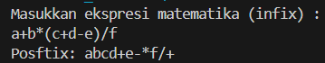

# Laporan Pratikum 8
## Percobaan 1 : Penyimpanan Tumpukan Barang dalam Gudang
#### Kode Program
Barang
```java
/**
 * Barang09
 */
public class Barang09 {

    int kode;
    String nama;
    String kategori;

    Barang09(int kode, String nama, String kategori){
        this.kode = kode;
        this.nama = nama;           
        this.kategori = kategori;
    }
}
```
Gudang
```java
public class Gudang09 {
    Barang09[] tumpukan;
    int size;
    int top;

    public Gudang09(int kapasitas) {
        size = kapasitas;
        tumpukan = new Barang09[size];
        top = -1;
    }

    public boolean cekKosong() {
        if (top == -1) {
            return true;
        } else {
            return false;
        }
    }

    public boolean cekPenuh() {
        if (top == size - 1) {
            return true;
        } else {
            return false;
        }
    }

    public void tambahBarang(Barang09 brg) {
        if (!cekPenuh()) {
            top++;
            tumpukan[top] = brg;
            System.out.println("Barang " + brg.nama + "berhasil ditambahkan ke Gudang");
        } else {
            System.out.println("Gagal! Tumpukan barang diGudang sudah penuh");
        }
    }

    public Barang09 ambilBarang09() {
        if (!cekKosong()) {
            Barang09 delete = tumpukan[top];
            top--;
            System.out.println("Barang " + delete.nama + " diambil dari Gudang");
            return delete;
        } else {
            System.out.println("Tumpukan barang kosong.");
            return null;
        }
    }

    public Barang09 lihatBarangTeratas() {
        if (!cekKosong()) {
            Barang09 barangTeratas = tumpukan[top];
            System.out.println("Barang teratas: " + barangTeratas.nama);
            return barangTeratas;
        } else {
            System.out.println("Tumpukan barang kosong.");
            return null;
        }
    }

    public void tampilkanBarang() {
        if (!cekKosong()) {
            System.out.println("Rincian tumpukan barang di Gudang: ");
            for (int i = top; i >= 0; i--) {
                System.out.printf("Kode %d: %s (Kategori %s)\n", tumpukan[i].kode, tumpukan[i].nama, tumpukan[i].kategori);
            }
        }else {
                System.out.println("Tumpukan barang kosong.");
        }
    }
}
```
Utama
```java
import java.util.Scanner;
public class Utama09 {
    public static void main(String[] args) {
        Scanner sc =new Scanner(System.in);
        Gudang09 gudang = new Gudang09(7);

        while(true){
            System.out.println("\nMenu");
            System.out.println("1. Tambah Barang");
            System.out.println("2. Ambil Barang");
            System.out.println("3. Tampilkan Barang Tumpukan");
            System.out.println("4. Keluar");
            System.out.print("Pilih Operasi : ");
            int pilihan = sc.nextInt();

            switch (pilihan) {
                case 1:
                    System.out.print("Masukkan kode barang: ");
                    int kode = sc.nextInt();
                    System.out.print("Masukkan nama barang: ");
                    String nama = sc.nextLine();
                    sc.nextLine();
                    System.out.print("Masukkan nama kategori: ");
                    String kategori = sc.nextLine();
                    Barang09 barangBaru = new Barang09(kode, nama, kategori);
                    gudang.tambahBarang(barangBaru);
                    break;
                case 2:
                    gudang.ambilBarang09();
                    break;
                case 3:
                    gudang.tampilkanBarang();
                    break;
                case 4:
                    break;
                default:
                    System.out.println("Pilihan tidak valid. Silahkan coba lagi.");
            }
        }
    }
}
```

#### Pertanyaan
1. Lakukan perbaikan pada kode program, sehingga keluaran yang dihasilkan sama dengan verifikasi 
hasil percobaan! Bagian mana saja yang perlu diperbaiki?
2. Berapa banyak data barang yang dapat ditampung di dalam tumpukan? Tunjukkan potongan kode 
programnya!
3. Mengapa perlu pengecekan kondisi !cekKosong() pada method tampilkanBarang? Kalau kondisi 
tersebut dihapus, apa dampaknya?
4. Modifikasi kode program pada class Utama sehingga pengguna juga dapat memilih operasi lihat 
barang teratas, serta dapat secara bebas menentukan kapasitas gudang!
5. Commit dan push kode program ke Github
#### Jawaban
2. Tumpukan dapat menampung maksimal 7 data barang.
    
3. pengecekan kondisi !cekKosong() diperlukan untuk memastikan keamanan dan jalannya program yang benar dari program saat berurusan dengan tumpukan barang yang mungkin kosong. Jika pengecekan ini dihapus, maka program akan mencoba mengakses elemen array tumpukan meskipun array tersebut kosong, yang dapat menyebabkan kesalahan atau perilaku yang tidak diinginkan.

4. Berikut kode yang telah dimodifikasi berdasarkan pertanyaan
```java
import java.util.Scanner;
public class Utama09 {
    public static void main(String[] args) {
        Scanner sc =new Scanner(System.in);
        System.out.print("Masukkan kapasitas gudang: ");
        int kapasitasGudang = sc.nextInt();
        Gudang09 gudang = new Gudang09(kapasitasGudang);

        while(true){
            System.out.println("\nMenu");
            System.out.println("1. Tambah Barang");
            System.out.println("2. Ambil Barang");
            System.out.println("3. Lihat barang teratas");
            System.out.println("4. Lihat Barang Terbawah");
            System.out.println("5. Tampilkan Barang Tumpukan");
            System.out.println("6. Keluar");
            System.out.print("Pilih Operasi : ");
            int pilihan = sc.nextInt();

            switch (pilihan) {
                case 1:
                    System.out.print("Masukkan kode barang: ");
                    int kode = sc.nextInt();
                    System.out.print("Masukkan nama barang: ");
                    String nama = sc.nextLine();
                    sc.nextLine();
                    System.out.print("Masukkan nama kategori: ");
                    String kategori = sc.nextLine();
                    Barang09 barangBaru = new Barang09(kode, nama, kategori);
                    gudang.tambahBarang(barangBaru);
                    break;
                case 2:
                    gudang.ambilBarang09();
                    break;
                case 3:
                    gudang.lihatBarangTeratas();
                    break;
                case 4:
                    gudang.lihatBarangTerbawah();
                    break;
                case 5:
                    gudang.tampilkanBarang();
                    break;
                case 6:
                    break;
                default:
                    System.out.println("Pilihan tidak valid. Silahkan coba lagi.");
            }
        }
    }
}
```

## Percobaan 2: Konversi Kode Barang ke Biner
#### Kode Program
Gudang
```java
public class Gudang09 {
    Barang09[] tumpukan;
    int size;
    int top;

    public Gudang09(int kapasitas) {
        size = kapasitas;
        tumpukan = new Barang09[size];
        top = -1;
    }

    public boolean cekKosong() {
        if (top == -1) {
            return true;
        } else {
            return false;
        }
    }

    public boolean cekPenuh() {
        if (top == size - 1) {
            return true;
        } else {
            return false;
        }
    }

    public void tambahBarang(Barang09 brg) {
        if (!cekPenuh()) {
            top++;
            tumpukan[top] = brg;
            System.out.println("Barang " + brg.nama + "berhasil ditambahkan ke Gudang");
        } else {
            System.out.println("Gagal! Tumpukan barang diGudang sudah penuh");
        }
    }

    public Barang09 ambilBarang09() {
        if (!cekKosong()) {
            Barang09 delete = tumpukan[top];
            top--;
            System.out.println("Barang " + delete.nama + " diambil dari Gudang");
            System.out.println("Kode unik dalam biner: " + konversiDesimalKeBiner(delete.kode));
            return delete;
        } else {
            System.out.println("Tumpukan barang kosong.");
            return null;
        }
    }

    public Barang09 lihatBarangTeratas() {
        if (!cekKosong()) {
            Barang09 barangTeratas = tumpukan[top];
            System.out.println("Barang teratas: " + barangTeratas.nama);
            return barangTeratas;
        } else {
            System.out.println("Tumpukan barang kosong.");
            return null;
        }
    }

    public Barang09 lihatBarangTerbawah() {
        if (!cekKosong()) {
            Barang09 barangTerbawah = tumpukan[0];
            System.out.println("Barang teratas: " + barangTerbawah.nama);
            return barangTerbawah;
        } else {
            System.out.println("Tumpukan barang kosong.");
            return null;
        }
    }

    public void tampilkanBarang() {
        if (!cekKosong()) {
            System.out.println("Rincian tumpukan barang di Gudang: ");
            for (int i = top; i >= 0; i--) {
                System.out.printf("Kode %d: %s (Kategori %s)\n", tumpukan[i].kode, tumpukan[i].nama, tumpukan[i].kategori);
            }
        }else {
                System.out.println("Tumpukan barang kosong.");
        }
    }

    public String konversiDesimalKeBiner(int kode){
        StackKonversi09 stack = new StackKonversi09();
        while (kode > 0) {
            int sisa = kode % 2 ;
            stack.push(sisa);
            kode = kode/ 2;
        }
        String biner = new String();
        while (!stack.isEmpty()){
            biner = biner + stack.pop();
        }
        return biner;

    }
}
```
StackKonversi
```java
/**
 * StackKonversi09
 */
public class StackKonversi09 {

    int size;
    int [] tumpukanBiner;
    int top;

    public StackKonversi09() {
        this.size = 32;
        tumpukanBiner = new int[size];
        top = -1;
    }

    public boolean isEmpty() {
        return top == -1;
    }

    public boolean isFull() {
        return top == size - 1;
    }

    public void push(int data) {
        if (isFull()) {
            System.out.println("Stack penuh");
        } else {
            top++;
            tumpukanBiner[top] = data;
        }
    }

    public int pop() {
        if (isEmpty()) {
            System.out.println("Stack kosong");
            return -1;
        } else {
            int data = tumpukanBiner[top];
            top--;
            return data;
        }
    }
}
```

#### Hasil Run


#### Pertanyaan
1. Pada method konversiDesimalKeBiner, ubah kondisi perulangan menjadi while (kode != 0), 
bagaimana hasilnya? Jelaskan alasannya!
2. Jelaskan alur kerja dari method konversiDesimalKeBiner!

#### Jawaban
1. 
    hasil run 
    modifikasi tersebut menghasilkan output yang sama dengan kondisi sebelumnya. 

2. Pertama, method ini membuat instance baru dari kelas StackKonversi09. Kelas StackKonversi09 digunakan untuk menyimpan sisa-sisa hasil pembagian dengan 2 secara sementara.
Kemudian, method memasuki perulangan while yang akan terus berjalan selama kode (bilangan desimal yang akan dikonversi) lebih besar dari 0.
Di dalam perulangan while, langkah pertama adalah menghitung sisa hasil pembagian kode dengan 2 menggunakan operasi modulo %. Sisa ini disimpan dalam variabel sisa.
Nilai sisa kemudian didorong (push) ke dalam stack menggunakan method push() dari kelas StackKonversi09.
Setelah itu, nilai kode diperbarui dengan hasil pembagian kode dengan 2 menggunakan operasi integer division /. Perulangan while akan terus berlanjut dengan mengulang langkah 3-5 hingga kode menjadi 0.
Setelah perulangan while selesai, maka semua sisa-sisa hasil pembagian dengan 2 telah disimpan dalam stack secara terbalik.
Selanjutnya, method membuat sebuah objek String baru yang kosong dengan nama biner.
Kemudian, method memasuki perulangan while baru yang akan berjalan selama stack tidak kosong.
Di dalam perulangan while ini, method mengambil elemen teratas dari stack menggunakan method pop() dan menambahkannya ke biner sebagai string.
Setelah perulangan while selesai, biner akan berisi representasi biner dari bilangan desimal yang dikonversi.
Terakhir, method mengembalikan biner sebagai hasil akhir.

## Percobaan 3: Konversi Notasi Infix ke Postfix
#### Kode Program
Postfix
```java
/**
 * Postfix09
 */
public class Postfix09 {

    int n;
    int top;
    char[] stack;

    public Postfix09(int total) {
        n = total;
        top = -1;
        stack = new char[n];
        push ('(');
    }

    public void push(char c) {
        top++;
        stack[top] = c;
    }

    public char pop() {
        char item = stack[top];
        top--;
        return item;
    }

    public boolean IsOperand(char c) {
        if ((c >= 'A' && c <= 'Z') || (c >= 'a' && c <= 'z') ||
        (c >= '0' && c <= '9') || c == ' ' || c == '.') {
            return true;
        } else {
            return false;
        }
    }

    public boolean IsOperator(char c) {
        if (c == '^' || c == '%' || c == '/' || c == '*' || c == '-' || c == '+') {
            return true;
        } else {
            return false;
        }
    }

    public int derajat(char c) {
        switch (c) {
            case '^':
                return 3;
            case '%':
                return 2;
            case '/':
                return 2;
            case '*':
                return 2;
            case '-':
                return 1;
            case '+':
                return 1;
            default:
                return 0;
        }
    }

    public String konversi (String Q) {
        String P = "";
        char c;
        for (int i = 0; i < n; i++) {
            c = Q.charAt(i);
            if (IsOperand(c)) {
                P = P + c;
            }
            if (c == '(') {
                push(c);
            }
            if (c == ')') {
                while (stack[top] != '(') {
                    P = P + pop();
                }
                pop();
            }
            if (IsOperator(c)) {
                while (derajat(stack[top]) >= derajat(c)) {
                    P = P + pop();
                }
                push(c);
            }
        }
        return P;
    }
}
```
PostfixMain
```java
/**
 * PostfixMain09
 */
import java.util.Scanner;
 public class PostfixMain09 {

    public static void main(String[] args) {
        Scanner sc = new Scanner(System.in);
        String P, Q;
        System.out.println("Masukkan ekspresi matematika (infix) : ");
        Q = sc.nextLine();
        Q = Q.trim();
        Q = Q + ")";

        int total = Q.length();

        Postfix09 post = new Postfix09(total);
        P = post.konversi(Q);
        System.out.println("Posftix: " + P);
    }
}
```
#### Hasil Run


#### Pertanyaan
1. Pada method derajat, mengapa return value beberapa case bernilai sama? Apabila return 
value diubah dengan nilai berbeda-beda setiap case-nya, apa yang terjadi?
2. Jelaskan alur kerja method konversi!
3. Pada method konversi, apa fungsi dari potongan kode berikut?

#### Jawaban
1. Dalam metode derajat, return value dari beberapa case bernilai sama karena hal tersebut mewakili prioritas operasi dalam aritmatika.
2. Metode konversi menerima sebuah parameter Q yang merupakan string ekspresi matematika dalam bentuk notasi infix.
Lalu sebuah string P diinisialisasi dengan nilai kosong. String ini akan digunakan untuk menyimpan hasil konversi ke notasi postfix.
Sebuah perulangan for dilakukan untuk mengiterasi setiap karakter dalam ekspresi infix Q.
Pada setiap iterasi, karakter c diambil dari ekspresi infix Q.
Jika c adalah operand (angka, huruf, spasi, atau titik), maka c akan ditambahkan ke string P.
Jika c adalah tanda kurung buka (, maka c akan didorong (push) ke dalam stack.
Jika c adalah tanda kurung tutup ), maka karakter-karakter dalam stack akan dikeluarkan (pop) dan ditambahkan ke string P satu per satu hingga ditemukan tanda kurung buka (. Tanda kurung buka ( ini kemudian dikeluarkan dari stack.
Jika c adalah operator (misalnya ^, %, /, *, -, atau +), maka program akan melakukan langkah-langkah berikut:
Selama derajat (prioritas) operator yang ada di puncak stack (stack[top]) lebih besar atau sama dengan derajat operator c, keluarkan operator dari stack dan tambahkan ke string P.
Setelah itu, dorong (push) operator c ke dalam stack.
Setelah semua karakter dalam ekspresi infix Q diproses, string P akan berisi ekspresi dalam notasi postfix yang dihasilkan.
Metode konversi mengembalikan string P sebagai hasil akhir.
3. Potongan kode c = Q.charAt(i); pada metode konversi berfungsi untuk mengambil karakter pada indeks ke-i dari string Q yang merupakan ekspresi matematika dalam notasi infix. Nilai karakter tersebut kemudian disimpan dalam variabel c.

## Latihan Praktikum
1. Method lihatBarangTerbawah digunakan untuk mengecek barang pada tumpukan terbawah
```java
 public Barang09 lihatBarangTerbawah() {
        if (!cekKosong()) {
            Barang09 barangTerbawah = tumpukan[0];
            System.out.println("Barang teratas: " + barangTerbawah.nama);
            return barangTerbawah;
        } else {
            System.out.println("Tumpukan barang kosong.");
            return null;
        }
    }
```
2. Method cariBarang digunakan untuk mencari ada atau tidaknya barang berdasarkan kode
barangnya atau nama barangnya
```java
public void cariBarang(String key) {
        boolean ditemukan = false;

        for (int j=0; j<=top; j++) {
            try {
                int kodeKey = Integer.parseInt(key);
                if (tumpukan[j].nama.equalsIgnoreCase(key) || tumpukan[j].kode == kodeKey) {
                    System.out.println("Barang ditemukan!");
                    ditemukan = true;
                    System.out.println("Kode Barang: "+ tumpukan[j].kode);
                    System.out.println("nama Barang: "+ tumpukan[j].nama);
                    System.out.println("Kategori Barang: "+ tumpukan[j].kategori);
                    return;
                }
            } catch (NumberFormatException e) {
                System.out.println("");
                break;
            }
        }

        for (int j=0; j<=top; j++) {
            if (tumpukan[j].nama.equalsIgnoreCase(key)){
                System.out.println("Barang ditemukan!");
                System.out.println("Kode Barang: "+ tumpukan[j].kode);
                System.out.println("nama Barang: "+ tumpukan[j].nama);
                System.out.println("Kategori Barang: "+ tumpukan[j].kategori);
                return;
            } else {
                System.out.println("");
            }
        }

        if (!ditemukan) {
            System.out.println("Barang tidak ditemukan!");
        }  
    }
```